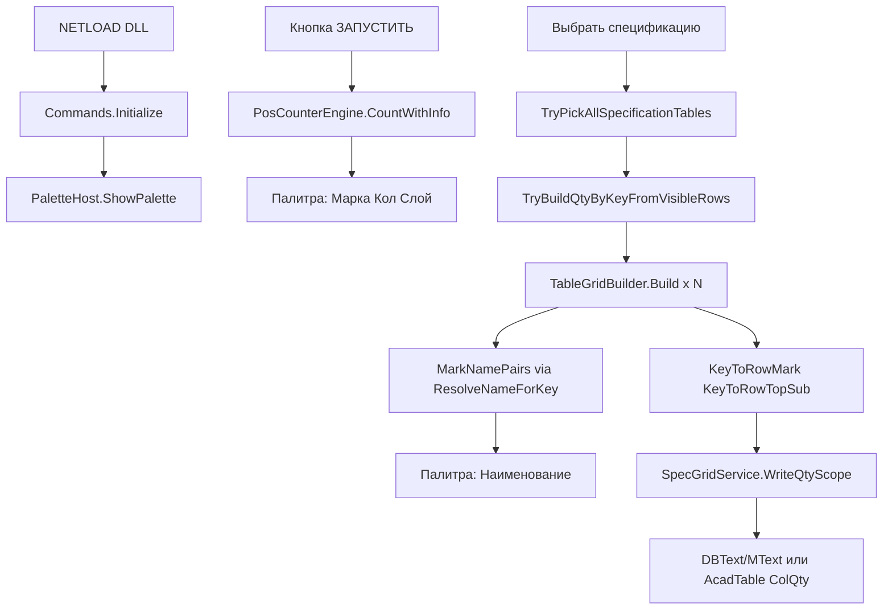

# Фактическая архитектура PosCounter.Net

Документ описывает **как программа реально работает** по текущему коду. Не ТЗ и не план изменений.

**Версия:** 4.2.0-table-grid-lines  
**Актуализация:** 2026-06-15  
**Сравнение со старой сборкой:** [.cursor/plans/diff_vs_PosCounter.Net1.md](diff_vs_PosCounter.Net1.md)

---

## 1. Общая схема



**Связь модулей:** номер марки (`Key`). Подсчёт выносок → количество в палитре. Спецификация → наименование в палитру + запись «Кол.» на чертёж **только из видимых строк палитры**.

**Палитра vs scope:** ЗАПУСТИТЬ даёт N ключей по всему чертежу; «Выбрать спецификацию» даёт M имён только по выделенным таблицам. M < N — нормально, если не все листы выделены.

**Отличие от PosCounter.Net1:** код подсчёта и спецификации **идентичен** эталону; изменён только источник qty при writeback (видимые строки, не `_lastCountRows`).

---

## 2. Точка входа и команды

| Файл | Роль |
|------|------|
| `Commands.cs` | `IExtensionApplication`: NETLOAD, POSC, служебные POSC2_* |
| `PaletteHost.cs` | WPF-палитра, очереди команд, **qty для writeback** |
| `UI/PosCounterControl.xaml.cs` | Кнопки, таблица, фильтры, экспорт, Сброс |

### Команды AutoCAD

| Команда | Кто вызывает | Действие |
|---------|--------------|----------|
| `NETLOAD` | инженер | `Initialize()` → на `Idle` открывается палитра |
| `POSC` | инженер | `PaletteHost.ShowPalette()` |
| `POSC2_RUN_INTERNAL` | палитра «ЗАПУСТИТЬ» | `PosCounterEngine` → строки в UI |
| `POSC2_SPEC_INTERNAL` | «Выбрать спецификацию» | pick таблиц, Build, имена, writeback qty |
| `POSC2_HIGHLIGHT_INTERNAL` | «Показать на чертеже» | transient-подсветка handles |

Инженер вводит только **NETLOAD** и **POSC**. LISP-загрузка не используется.

---

## 3. Модуль 1 — подсчёт выносок (`PosCounterEngine`)

**Файл:** `Engine/PosCounterEngine.cs` — **идентичен PosCounter.Net1**

- Источник: выделение **или** галочка «Все объекты в модели».
- Типы: `DBText`, `MText`, атрибуты блоков (рекурсия).
- **Не обрабатывается:** `MLeader`, `ProxyEntity` (СПДС proxy).
- `ExtractPositionNumber` / `MarkKeyParser.TryParse` — цифры 1..10000; группировка `(слой, текст)` → `Quantity`.
- `MTextPlainText.ResolveLayer` — слой `0` → слой блока; xref `|` отрезается.

**Нет** `CalloutMarkGate` — фильтры выносок по геометрии (треугольник/круг) не применяются.

---

## 4. Модуль 2 — спецификация (orchestration)

**`SpecGridService.RunSelectSpecification`:**

1. `TryPickAllSpecificationTables` — N рамок, Enter без выделения = конец.
2. `TableGridBuilder.Build(i, ids, tr, sharedGridLayer, log)` на каждую рамку.
3. `MergeScopeNames` → `BuildCombinedMarkNames` → палитра.
4. `WriteQtyInTransaction` → `UpsertQtyText` (LINE) или `UpsertQtyInAcadTable` (native Table).

**`SpecGridSession`:** список scope'ов; `SharedGridLayer` для нескольких таблиц на листе; **`SpecColumnSchema`** — наследование столбцов для 2-й таблицы без шапки.

---

## 5. Выбор пути Build

| Условие выборки | Путь |
|-----------------|------|
| есть `Table`, нет `Line` | **`BuildFromAcadTable`** |
| есть `Line` (с Table или без) | **LINE path** |
| Table + Line вместе | WARN `[POSC] Mixed selection…`, LINE path |

---

## 6. LINE path — `TableGridBuilder.Build()`

**Файл:** `SpecGrid/TableGrid.cs` (~7500 строк) — **идентичен PosCounter.Net1**

### 6.1. Сбор и сетка

- LINE → `GridLineSeg`; DBText/MText → `TextSample` (напрямую, без Explode proxy).
- `AutoDetectGridLayer` (≥30%, `MinGridLineLen=5000` для выбора слоя).
- `BuildMergedGridAxes` — Y **сверху вниз** (`sortAsc: false`).
- Лимиты: `MaxLines/Texts=20000`, `MaxCells=5000`.

### 6.2. Pass 1 — шапка

| # | Метод | Назначение |
|---|-------|------------|
| 1 | `AssignCellsHeader` | Row/Col по HeaderX/Y = ExtentsCenter |
| 2 | `BuildCellMatrix(false)` | CellText, все слои |
| 3 | `DetectHeader` / `DetectHeaderByGridRows` | grid rows → columns → top-band (fallback) |
| 4 | **`ApplyMarkAnchoredHeaderBoundary`** | цифра в ColMark → `RowDataStart` / `HeaderEndRow` |
| 5 | `FindHeaderEndRowByHorizontalBorders` | H-линии **только до firstMarkRow−1** |
| 6 | `ApplyHeaderBoundaryFromGridScan` | скан строк; `IsGridScanDataRow` — марка только ColMark |
| 7 | `ComputeRowDataStart` | уточнение; `AlignRowDataStartToFirstMark` по `min(KeyToRowTopSub)` |
| 8 | `BuildPrimaryNameLayer`, `BuildTableContentLayers` | слои ColName / allowed |
| 9 | **`TryLockColumnSchema`** | 2-я таблица без шапки — наследует ColMark/ColName/ColQty |

### 6.3. Pass 2 — данные + KV

| # | Метод | Назначение |
|---|-------|------------|
| 10 | `AssignCellsData` | DataX/Y; Row по точке; DominantRow |
| 11 | `SplitNameColumnRowsData` | MText+DBText в одной ячейке NAME |
| 12 | `BuildTextsByRow` | кэш ColName по Row |
| 13 | `BuildCellMatrix(true)` | CellText, filtered layers |
| 14 | **`BindKeysFromProperties`** | KeyToRowMark (ключ) |
| 15 | `BindKeys` | KeyToRowTopSub, KeyToMarkBlockEnd |
| 16 | **`FillMarkNamesFromMergeGroups`** | MarkNamePairs через **`ResolveNameForKey`** |

---

## 7. Распознавание шапки (факт)

### 7.1. Приоритет границы шапки / данных

1. **Якорь ColMark (`markAnchor`)** — первая цифра-марка в столбце «Поз.» = выход из шапки.
2. **Токены шапки** — `HeaderTokenEndRow`, `ResolveHeaderOnlyEndRow`.
3. **H-линии** — `FindHeaderEndRowByHorizontalBorders`: не ниже firstMarkRow−1.
4. **Grid scan** — марка только в ColMark; qty-hint только ColQty.

CMD: `[HEADER-DATA-ROW] markAnchor firstMarkRow=… blockTop=… rule=colMark-digit`.

### 7.2. Столбцы шапки

1. **`DetectHeaderByGridRows`** (primary).
2. **`DetectHeaderByColumns`** — fallback.
3. **`DetectHeaderByTopTextBand`** — last-resort.

`EnsureUniqueHeaderColumns`: **Марка → Кол. → Наименование**.

### 7.3. Вторая таблица (заголовок раздела)

- **`TryLockColumnSchema`** / `SpecColumnSchema` копирует ColMark, ColName, ColQty.
- Заголовок раздела без цифры в ColMark **не попадает в палитру**.

---

## 8. Ключ (марка) — LINE path

**`BindKeysFromProperties`** + **`IsBindableDataText`:**

- `t.Row >= RowDataStart`.
- `IsTextInColumnXBand(ColMark)`, `MarkKeyParser.TryParse`, не `IsSectionHeaderRow`.
- Bleed: `t.Col != ColMark` и длина > 4 → skip.

---

## 9. Значение (наименование) — `ResolveNameForKey`

**Точка входа:** `FillMarkNamesFromMergeGroups` → **`ResolveNameForKey(key)`**.

- Диапазон continuation: **`[rowTop, blockEnd)`**.
- Сбор: CellText + dual-pass + dedupe + anti-bleed.
- Fallback: `CellText[rowMark, ColName]`, соседние col ±1.

---

## 10. Native AutoCAD Table — `BuildFromAcadTable`

1. `CellText` из `table.Cells[r,c].TextString`.
2. Те же DetectHeader / markAnchor / BindKeys / `ResolveNameForKey`.
3. Qty: **`UpsertQtyInAcadTable`**.

---

## 11. Запись «Кол.» (`SpecGridService` + `PaletteHost`)

### Источник количества (отличие от PosCounter.Net1)

```
POSC2_SPEC_INTERNAL
  → PaletteHost.TryBuildQtyByKeyForWriteback
  → PosCounterControl.TryBuildQtyByKeyFromVisibleRows
  → GetVisibleDataRows() — строки палитры после фильтров
  → сумма Count по Key
```

| | PosCounter.Net1 | Сейчас |
|---|-----------------|--------|
| Источник qty | `_lastCountRows` (все строки) | **видимые** строки палитры |
| После Сброс без ЗАПУСТИТЬ | риск старых qty | `qtyByKey` пуст → запись 0 |

### Запись на чертёж (без изменений)

- Точка: `ResolveQtyInsertPoint` — центр ColQty по сетке.
- Merged ColQty: `ResolveQtyCellRowBottomExByColQtyGrid`.
- Стиль: `ResolveQtyTableTextAppearanceForScope(tr, scope, rowTop)`.
- **На чертёж пишется только ColQty.** Наименование не перезаписывается.

---

## 12. Кнопка Сброс

`ResetPaletteState` в `PosCounterControl`:

- очищает `_lastCountRows`, `_rowsAll`, `_lastMarkNames`, `SpecGridSession`;
- сбрасывает фильтры палитры;
- **не удаляет** уже записанные цифры на чертеже (только состояние палитры).

---

## 13. Вспомогательные модули

| Файл | Назначение |
|------|------------|
| `CellIndex.cs` | TryGetCellIndex, GetCellText, GetDominantRow |
| `MTextPlainText.cs` | санитизация, NameScore; MarkKeyParser |
| `MarkKeyParser.cs` | разбор марки (поз., №, 1..10000) |
| `SpecColumnSchema.cs` | наследование столбцов между scope |
| `SpecDiagPolicy.cs` | sample keys для CMD |
| `SpecGridLog.cs` | Info/Debug/Success в CMD |
| `SpecGridSession.cs` | сессия scope'ов |
| `ExportService.cs` | Excel/CSV из палитры |

**Удалены (не в текущей версии):** `CalloutMarkGate.cs`, `ProxyEntityHelper.cs`.

---

## 14. Сборка

| AutoCAD | Framework | Как собрать | Выход |
|---------|-----------|-------------|-------|
| 2016–2024 | net452 | **Visual Studio:** Release \| x64 \| net452 | `bin\x64\Release\net452\` + `System.ValueTuple.dll` |
| 2025–2026 | net8.0-windows | VS: Release \| x64 \| net8.0-windows | `dll 2026\` или `bin\x64\Release\net8.0-windows\` |

- Путь AC 2016: `PosCounter.Net\build\AutoCAD.props` → `AutoCADSdkDirNet46`.
- Инструкция: `PosCounter.Net\build\СБОРКА_VS_AC2016.md`, `README_СБОРКА_AC2016.txt`.
- Скрипты `build-ac2016.cmd` / `build-ac2026.cmd` **удалены** — сборка вручную в VS.

| Артефакт | Назначение |
|----------|------------|
| `build/verify-no-duplicate-sources.ps1` | CS0101: дубликаты SpecGridService |
| MSBuild `VerifyNoDuplicateSources` | проверка перед CoreCompile |

---

## 15. Красные зоны (не ломать без ТЗ)

- `PosCounterEngine` — идентичен эталону Net1.
- `BuildMergedGridAxes`, порядок GridYs desc.
- Pass-1 шапка: markAnchor, `DetectHeader*`.
- Qty writeback — **только видимые строки палитры** (`TryBuildQtyByKeyFromVisibleRows`).
- Qty на чертёж — только ColQty; место вставки не менять без ТЗ.

---

## 16. Чеклист ручной проверки

| # | Кейс | Ожидание |
|---|------|----------|
| H | любая таблица | CMD «Распознана шапка», ColMark/ColName/ColQty |
| 1 | первая марка после шапки | markAnchor, имя марки 1 не пустое |
| Qty | фильтр слоя в палитре | в «Кол.» — сумма **видимых** строк, не скрытых |
| Reset | Сброс → Выбрать спецификацию без ЗАПУСТИТЬ | WriteQty записано=0 |
| Pal | N ключей, M имён | M < N если не все листы — не баг |

---

## 17. Связанные документы

| Документ | Аудитория |
|----------|-----------|
| [diff_vs_PosCounter.Net1.md](diff_vs_PosCounter.Net1.md) | что изменилось vs старая сборка |
| `docs/DEVELOPER.md` | разработчик |
| `docs/INSTRUCTION_ENGINEER.md` | инженер |
| `Работа программы.md` | Q&A простым языком |
| `docs/BUILD.md` | сборка DLL |
| `.cursor/DIALOGUE_LOG.md` | история правок |
