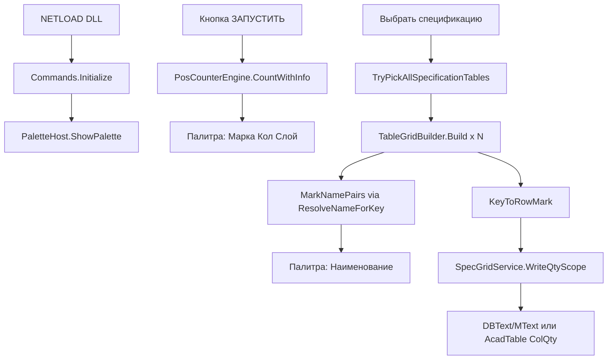

# Фактическая архитектура PosCounter.Net

Документ описывает **как программа реально работает** по текущему коду. Не ТЗ и не план изменений.

**Версия:** 4.2.0-table-grid-lines  
**Актуализация:** 2026-06-09

---

## 1. Общая схема

**Связь модулей:** номер марки (`Key`). Подсчёт выносок → количество в палитре. Спецификация → наименование в палитру + запись «Кол.» на чертёж.

---

## 2. Точка входа и команды

| Файл | Роль |
|------|------|
| `Commands.cs` | `IExtensionApplication`: NETLOAD, POSC, служебные POSC2_* |
| `PaletteHost.cs` | WPF-палитра, очереди команд, payload спецификации |
| `UI/PosCounterControl.xaml.cs` | Кнопки, таблица, фильтры, экспорт, Сброс |

### Команды AutoCAD

| Команда | Кто вызывает | Действие |
|---------|--------------|----------|
| `NETLOAD` | инженер | `Initialize()` → на `Idle` открывается палитра |
| `POSC` | инженер | `PaletteHost.ShowPalette()` |
| `POSC2_RUN_INTERNAL` | палитра «ЗАПУСТИТЬ» | `PosCounterEngine` → строки в UI |
| `POSC2_SPEC_INTERNAL` | «Выбрать спецификацию» | pick таблиц, Build, имена, writeback qty |
| `POSC2_HIGHLIGHT_INTERNAL` | «Показать на чертеже» | transient-подсветка handles |

---

## 3. Модуль 1 — подсчёт выносок (`PosCounterEngine`)

**Файл:** `Engine/PosCounterEngine.cs` (**PALETTE-COUNT-LOCK — не менять без ТЗ**)

- Источник: выделение **или** галочка «Все объекты в модели».
- Типы: `DBText`, `MText`, атрибуты блоков (рекурсия).
- **Не обрабатывается:** `MLeader`, proxy СПДС.
- `ExtractPositionNumber` — цифры 1..10000; группировка `(слой, текст)` → `Quantity`.
- `MTextPlainText.ResolveLayer` — слой `0` → слой блока; xref `|` отрезается.

---

## 4. Модуль 2 — спецификация (orchestration)

**`SpecGridService.RunSelectSpecification`:**

1. `TryPickAllSpecificationTables` — N рамок, Enter без выделения = конец.
2. `TableGridBuilder.Build(i, ids, tr, sharedGridLayer, log)` на каждую рамку.
3. `MergeScopeNames` → `BuildCombinedMarkNames` → палитра.
4. `WriteQtyInTransaction` → `UpsertQtyText` (LINE) или `UpsertQtyInAcadTable` (native Table).

---

## 5. Выбор пути Build

| Условие выборки | Путь |
|-----------------|------|
| есть `Table`, нет `Line` | **`BuildFromAcadTable`** |
| есть `Line` (с Table или без) | **LINE path** |
| Table + Line вместе | WARN `[POSC] Mixed selection…`, LINE path |

---

## 6. LINE path — `TableGridBuilder.Build()`

**Файл:** `SpecGrid/TableGrid.cs`

### 6.1. Сбор и сетка

- LINE → `GridLineSeg`; DBText/MText → `TextSample`.
- `AutoDetectGridLayer` (≥30%, `MinGridLineLen=5000` для выбора слоя).
- `BuildMergedGridAxes` — Y **сверху вниз** (`sortAsc: false`).
- Лимиты: `MaxLines/Texts=20000`, `MaxCells=5000`.

### 6.2. Pass 1 — шапка

| # | Метод | Назначение |
|---|-------|------------|
| 1 | `AssignCellsHeader` | Row/Col по HeaderX/Y = ExtentsCenter |
| 2 | `BuildCellMatrix(false)` | CellText, все слои |
| 3 | `EstimateHeaderEndRow` | H-линии / первая марка (minRow=0) |
| 4 | **`ApplyHeaderBoundaryFromGridScan`** | скан строк 0..N → `HeaderEndRow`/`RowDataStart` |
| 5 | **`DetectHeader`** | grid rows → columns → top-band (last-resort) |
| 6 | `ComputeRowDataStart(null)` | searchFrom из grid scan; `ClampRowDataStartToGridScan` |
| 7 | `BuildPrimaryNameLayer`, `BuildTableContentLayers` | слои ColName / allowed |

### 6.3. Pass 2 — данные + KV

| # | Метод | Назначение |
|---|-------|------------|
| 8 | `AssignCellsData` | DataX/Y; Row по точке; DominantRow |
| 9 | `SplitNameColumnRowsData` | MText+DBText в одной ячейке NAME |
| 10 | `BuildTextsByRow` | кэш ColName по Row |
| 11 | `BuildCellMatrix(true)` | CellText, filtered layers |
| 12 | `ComputeRowDataStart(filteredH)` | уточнение RowDataStart |
| 13 | **`BindKeysFromProperties`** | KeyToRowMark (ключ) |
| 14 | `BindKeys` | KeyToRowTopSub, KeyToMarkBlockEnd |
| 15 | `AlignRowDataStartToFirstMark` | min KeyToRowMark |
| 16 | **`FillMarkNamesFromMergeGroups`** | MarkNamePairs через **`ResolveNameForKey`** |

---

## 7. Распознавание шапки (факт)

### 7.1. Граница шапки / данных — grid scan

- **`FindFirstDataRowByGridScan`**: строки 0..N; первая data-строка:
  - марка: `TryParseMarkKey` и не `IsHeaderLabelInMarkCell`;
  - или наименование+qty (длинный текст без слов шапки + цифра/qty в строке).
- `HeaderEndRow = RowDataStart = firstDataRow`.
- **Единый алгоритм** для всех таблиц — без деления «малая/большая».

### 7.2. Столбцы шапки — порядок DetectHeader

1. **`DetectHeaderByGridRows`** (primary) — `BuildHeaderOnlyColumnText` по строкам `0..HeaderEndRow-1`; `ScoreHeader` / **`ScoreQtyHeader`** (без «ед», штраф «масса»); `SanitizeColQtyColumn`; `RefineColMarkByDataMarks`.
2. **`DetectHeaderByColumns`** — fallback по ячейкам сетки.
3. **`DetectHeaderByTopTextBand`** — last-resort: Y-полоса maxY−2000, фильтр `Row < HeaderEndRow`, skip data marks.

`EnsureUniqueHeaderColumns`: **Марка → Кол. → Наименование**.

### 7.3. RowDataStart

- `ComputeRowDataStart`: `searchFrom = RowDataStart` из grid scan (если >0), иначе `FindFirstDataRowAfterHeaderBoundary` (**без min row 2**).
- `ClampRowDataStartToGridScan` — не поднимать RowDataStart выше grid scan, если марка на более ранней строке.

**CMD:** `[POSC] Распознана шапка…`, `[POSC] Граница шапки/данных`, `[POSC] KeyToRowMark`, `FormatMissingKeyOneDiagnostic`.

---

## 8. Ключ (марка) — LINE path

**`BindKeysFromProperties`** + **`IsBindableDataText`:**

- `t.Row >= RowDataStart` (основной фильтр).
- Запасной Y: `DataY < ResolveDataYCutoff` = `GridYs[RowDataStart]` (не maxY−2000).
- `IsTextInColumnXBand(ColMark)`, `TryParseMarkKey`, не `IsSectionHeaderRow`.
- Bleed: `t.Col != ColMark` и длина > 4 → skip.

**Границы:** `BindKeys` → `KeyToRowTopSub`, `KeyToMarkBlockEnd`, `GetNextKeyRowExclusive`.

---

## 9. Значение (наименование) — `ResolveNameForKey`

**Точка входа:** `FillMarkNamesFromMergeGroups` → **`ResolveNameForKey(key)`** (LINE, native Table, N scopes).

### 9.1. Диапазон строк

- `ResolveNameRowTopForKey`: `≥ HeaderEndRow`, `≥ RowDataStart`, skip секций.
- `rowEndExclusive` = `GetNextKeyRowExclusive(key)`.

### 9.2. Сбор имени

1. **`CollectNamePartsFromCellText`** — `TryAddNamePartExact`.
2. Если `cellJoined.Length ≥ 20` → **cell-only** (без AllTexts), `[NAME-DEDUPE]`.
3. Иначе dual-pass: `CollectNamePartsForPositionRange` + `SupplementNamePartsInVerticalBand` + `FilterTextPartsNotInCellText`.
4. **`CollapseDuplicateNamePhrase`** — «A A» → «A».
5. Fallback: `CellText[rowMark, ColName]`, соседние col ±1, `[KV-ANCHOR]`.

### 9.3. Фильтры dual-pass

- `PassesCellLayerFilter`, `IsTextInColumnXBand(ColName)`, `TextOverlapsRowBand`.
- **`NameTextBelongsToMarkKey`** / `ResolveOwnerMarkKeyForNameText` — anti foreign bleed.
- `[NAME-FOREIGN-SKIP]`, `[NAME-ROW]`, `[NAME-SUPPLEMENT]`, `[KV-PAIR]`, `[NAME-BOUNDARY]`.

### 9.4. CellIndex dedupe

- `IsDuplicateCandidate` — near-overlap MText+MText в ColName (4× eps).

---

## 10. Native AutoCAD Table — `BuildFromAcadTable`

1. `CellText` из `table.Cells[r,c].TextString`.
2. `DetectHeaderFromCellMatrix` — те же score/refine.
3. `RowDataStart` — первая марка в ColMark.
4. `BindKeysFromAcadTableCellMatrix`, merged → `KeyToRowTopSub`.
5. `FillMarkNamesFromAcadTableCells` → `ResolveNameForKey`.
6. Qty: **`UpsertQtyInAcadTable`** (число в «5 шт.» → «12 шт.»).

**Не вызываются:** AssignCellsData, SplitNameColumnRowsData, BindKeysFromProperties, dual-pass AllTexts.

---

## 11. Геометрия TextSample

| Поле | Pass-1 | Pass-2 |
|------|--------|--------|
| HeaderX/Y | ExtentsCenter | — |
| DataX/Y | — | DBText: точка; MText: X=Location.X, **Y=YMax** |
| Row/Col | по Header | по DataX/Y + DominantRow |
| YMin/YMax | экстент | экстент |

---

## 12. Запись «Кол.» (`SpecGridService`)

- Qty: `TryBuildQtyByKeyForWriteback` — сумма по **видимым** строкам палитры.
- Точка: `ResolveQtyInsertPoint` — центр ColQty по сетке.
- Merged ColQty: `ResolveQtyCellRowBottomExByColQtyGrid`, cap `ResolveNextKeyRowTopEx`.
- Стиль: `ResolveQtyTableTextAppearanceForScope` — ColQty → body → 2.5.
- **На чертеж пишется только ColQty.** Наименование не перезаписывается. Примечания инженера сохраняются.

---

## 13. Вспомогательные модули

| Файл | Назначение |
|------|------------|
| `CellIndex.cs` | TryGetCellIndex, GetCellText, GetDominantRow, IsDuplicateCandidate |
| `MTextPlainText.cs` | санитизация, TryParseMarkKey, NameScore, section/standalone |
| `SpecGridLog.cs` | Info/Debug/Success в CMD |
| `ExportService.cs` | Excel/CSV из палитры |
| `PosSettingsStore.cs` | настройки UI |

---

## 14. Красные зоны (не ломать без ТЗ)

- `PosCounterEngine` — PALETTE-COUNT-LOCK.
- `BuildMergedGridAxes`, порядок GridYs desc.
- Pass-1 шапка: `AssignCellsHeader`, grid scan boundary, `DetectHeader*`.
- Qty — только ColQty; палитра qty = вывод engine.

---

## 15. Чеклист ручной проверки

| # | Чертёж / кейс | Ожидание |
|---|---------------|----------|
| H | любая таблица | CMD «Распознана шапка», ColMark/ColName/ColQty |
| 1 | **Ушко** (1 строка шапки) | `RowDataStart=1`, `KeyToRowMark: 1→row1`, имя марки 1 |
| Qty | Ушко | ColQty = «Кол.», не «Масса» |
| 64 | **_tex_fek** | одно имя без дубля «Кран… Кран…» |
| 52 | _tex_fek | многострочное имя (dual-pass) |
| 4/5 | _tex_fek | mark 5 без текста mark 4 (owner mark) |
| 35NK | большая спец. | шапка DBText/MText без регрессии |
| Qty | merged ColQty | цифра по центру ячейки, высота из таблицы |

---

## 16. Связанные документы

| Документ | Аудитория |
|----------|-----------|
| `docs/DEVELOPER.md` | разработчик — методы и условия |
| `docs/INSTRUCTION_ENGINEER.md` | инженер — пошаговая работа |
| `Работа программы.md` | все — Q&A простым языком |
| `docs/BUILD.md` | сборка DLL |
| `.cursor/DIALOGUE_LOG.md` | история правок и неудачных попыток |
