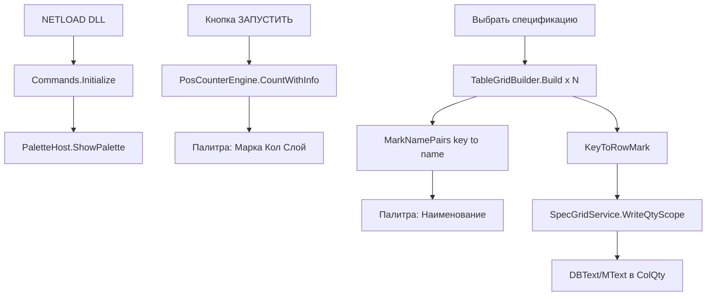

# Фактическая архитектура PosCounter.Net

Документ описывает **как программа реально работает** по текущему коду. Не ТЗ и не план изменений.

---

## 1. Общая схема

**Связь модулей:** номер марки (`Key`). Подсчёт выносок → количество в палитре. Спецификация → наименование в палитру + запись «Кол.» на чертёж.

---

## 2. Точка входа и команды

| Файл | Роль |
|------|------|
| `Commands.cs` | `IExtensionApplication`: NETLOAD, POSC, служебные POSC2_* |
| `PaletteHost.cs` | WPF-палитра, очереди команд, payload спецификации |
| `UI/PosCounterControl.xaml.cs` | Кнопки, таблица, фильтры, экспорт |

### Команды AutoCAD

| Команда | Кто вызывает | Действие |
|---------|--------------|----------|
| `NETLOAD` | инженер | `Initialize()` → на `Idle` открывается палитра |
| `POSC` | инженер | `PaletteHost.ShowPalette()` |
| `POSC2_RUN_INTERNAL` | палитра «ЗАПУСТИТЬ» | `PosCounterEngine` → строки в UI |
| `POSC2_SPEC_INTERNAL` | «Выбрать спецификацию» | pick таблиц, Build, имена, writeback qty |
| `POSC2_HIGHLIGHT_INTERNAL` | «Показать на чертеже» | transient-подсветка handles |

---

## 3. Модуль 1 — подсчёт выносок (`PosCounterEngine`)

**Файл:** `Engine/PosCounterEngine.cs` (**не менять без ТЗ**)

### Источник объектов

- Выделение на чертеже **или** галочка «Все объекты в модели» (модель / viewport на листе).
- Без выделения и без галочки — подсчёт не выполняется.

### Обрабатываемые типы

- `DBText`, `MText`, атрибуты блоков (рекурсивно вложенные `BlockReference`).
- **Не обрабатывается:** `MLeader`, proxy СПДС.

### Извлечение марки

- `ExtractPositionNumber` / `NormalizeText` — срез приставок («Поз.», «Марка», «№»…), остаются только цифры 1..10000.
- Группировка: `(слой, нормализованный текст)` → `Quantity`.

### Слой

- `MTextPlainText.ResolveLayer` — для слоя `0` берётся слой вставки блока; xref-префикс `|` отрезается.

---

## 4. Модуль 2 — спецификация (обзор)

**Сессия:** `SpecGridSession` — список `ScopeGridResult` (по одному на каждую рамку таблицы).

**Orchestration:** `SpecGridService.RunSelectSpecification`:

1. `TryPickAllSpecificationTables` — цикл рамок, Enter без выделения = конец.
2. Для каждой рамки: `TableGridBuilder.Build(scopeIndex, objectIds, tr, sharedGridLayer, log)`.
3. `MergeScopeNames` → `BuildCombinedMarkNames` → палитра.
4. `WriteQtyInTransaction` → для каждой марки `UpsertQtyText` в ColQty.

---

## 5. `TableGridBuilder.Build()` — полный конвейер

**Файл:** `SpecGrid/TableGrid.cs`, класс `TableGridBuilder`.

### 5.1. Сбор сущностей из рамки

- Перебор `objectIds` в транзакции.
- `LINE` → `AddLine` → списки `horiz` / `vert` (`GridLineSeg`).
- `DBText` → `CreateTextSampleFromDbText`.
- `MText` → `CreateTextSampleFromMText`.
- Лимиты: `MaxLines=20000`, `MaxTexts=20000`, `MaxCells=5000`.

### 5.2. Сетка (оси X/Y)

- `AutoDetectGridLayer` — слой с ≥30% «кандидатных» линий (`IsGridCandidate`: длина ≥ `MinGridLineLen=5000` только для **выбора слоя**).
- `BuildMergedGridAxes` — кластеризация `ClusterAxis` (eps 1.5); при mixed layers — merge осей с других слоёв (`GridAxesMergedFromMixedLayers`).
- **Y сортируется сверху вниз** (`sortAsc: false`) — критично для `TryGetCellIndex`.
- Результат: `GridXs`, `GridYs`, `rows`, `cols`. Минимум 4 оси по каждой оси.

### 5.3. Pass 1 — шапка (координаты Header)

| Шаг | Метод | Что делает |
|-----|-------|------------|
| 1 | `AssignCellsHeader` | `Row/Col` по `HeaderX/Y` = центр ExtentsCenter |
| 2 | `BuildCellMatrix(filterTableLayers:false)` | матрица `CellText`, все слои |
| 3 | `EstimateHeaderEndRow` | граница шапки по H-линиям / первой марке |
| 4 | `DetectHeader` | ColMark, ColName, ColQty |
| 5 | `ComputeRowDataStart(horiz:null)` | первая строка данных (pass-1) |
| 6 | `BuildPrimaryNameLayer` | PrimaryNameLayer + ExtraNameLayers для ColName |
| 7 | `BuildTableContentLayers` | AllowedTableTextLayers / ExcludedAnnotationLayers |

### 5.4. Pass 2 — данные (координаты Data)

| Шаг | Метод | Что делает |
|-----|-------|------------|
| 8 | `AssignCellsData` | `DataX/DataY`; `Row` по точке; `DominantRow` по экстенту |
| 9 | `SplitNameColumnRowsData` | разнос MText+DBText в одной ячейке NAME на соседние строки |
| 10 | `BuildTextsByRow` | кэш ColName-текстов по `t.Row` |
| 11 | `BuildCellMatrix(filterTableLayers:true)` | матрица только разрешённых слоёв |
| 12 | `ComputeRowDataStart(filteredH)` | уточнение RowDataStart |
| 13 | `BindKeysFromProperties` | **ключ:** KeyToRowMark из ColMark Contents |
| 14 | `BindKeys` | KeyToRowTopSub, KeyToMarkBlockEnd |
| 15 | `AlignRowDataStartToFirstMark` | выравнивание начала данных |
| 16 | `FillMarkNamesFromMergeGroups` | **значение:** MarkNamePairs |

---

## 6. Распознавание шапки (факт)

### 6.1. Основной путь — верхняя текстовая полоса

- `TryGetHeaderTopTextBandY`: `[maxY − HeaderTopBandHeight(2000) .. maxY]`.
- `DetectHeaderByTopTextBand`: ключевые слова в текстах полосы; столбец по `ResolveColumnIndexByX` (геометрия X, **не** Row/Col сетки).
- `EnsureUniqueHeaderColumns`: порядок **Марка → Кол. → Наименование**, без дублирования столбцов.
- `RefineColMarkByDataMarks`: если в ColMark < 2 марок в данных — столбец с max цифрами.

### 6.2. Fallback

- `DetectHeaderByColumns` — по `CollectHeaderTextForColumn` (Row/Col + геометрия + CellText).
- `MinHeaderScore = 10` — без совпадения слова столбец = -1.

### 6.3. Текст шапки для MText/DBText

- Pass-1: `HeaderX/Y` = центр `GeometricExtents`.
- `BuildHeaderTextForColumn` / `CollectHeaderTextForColumn` — проходы A/B/C.

**CMD:** `SpecGridService.ReportDetectedHeader` — «Распознана шапка…», ColMark/ColName/ColQty.

---

## 7. Ключ (марка) — properties KV

**Метод:** `BindKeysFromProperties`

- Источник: `AllTexts` в полосе ColMark (`IsTextInColumnXBand`).
- Парсинг: `MTextPlainText.TryParseMarkKey(Raw/Plain)` — хвост `. , ; : ) ]` отрезается.
- Отсечение шапки: `DataY >= HeaderTopBandLo` → skip.
- Конфликт двух марок в одной строке → победитель по CellText или верхний по DataY.
- Результат: `KeyToRowMark`, `RowToKeyMark`.

**Границы блока:** `BindKeys` → `KeyToRowTopSub`, `KeyToMarkBlockEnd` (`GetMarkBlockEndExclusive`, `FindRowTopSub`).

---

## 8. Значение (наименование) — dual-pass + owner mark

**Точка входа:** `ResolveNameFromMergeGroup(key)` ← `FillMarkNamesFromMergeGroups`.

### 8.1. Диапазон строк

- `rowTop` = `KeyToRowTopSub[key]` или `KeyToRowMark[key]`.
- `rowEndExclusive` = `GetNextKeyRowExclusive(key)` — до верха следующей марки.

### 8.2. Pass 1 — по строкам сетки

`CollectNamePartsForPositionRange` → для каждой строки `r`:

`CollectNamePartsFromNameCell`:

- Фильтры: `PassesCellLayerFilter`, `IsTextInColumnXBand(ColName)`, `TextOverlapsRowBand`, **`NameTextBelongsToMarkKey`**.
- **Все** прошедшие тексты (без PickBest winner).
- `AddNamePartsFromTextSample` → `EnumerateDisplayNameLines` → `TryAddNamePartExact`.
- `consumedSources` — один MText с `\P` не дублируется на строках.
- `[NAME-STOP]` — второй standalone в одной марке.

### 8.3. Pass 2 — vertical supplement

`SupplementNamePartsInVerticalBand`:

- Y-полоса блока: `GridYs[rowTop]` .. `GridYs[rowEndExclusive]`.
- `DataY` в полосе, **без** TextOverlapsRowBand.
- Тот же **`NameTextBelongsToMarkKey`**.
- Добор пропущенных DBText с «съехавшим» Row.

### 8.4. Owner mark (anti foreign bleed)

- `ResolveOwnerMarkKeyForNameText`: markAtPoint (`t.Row`) + markAtDom (`DominantRow`); при конфликте — марка **верхней** строки `Math.Min(t.Row, domRow)`.
- `NameTextBelongsToMarkKey`: owner == key, или owner==0 и `t.Row` в блоке марки.
- Лог: `[NAME-FOREIGN-SKIP]` (keys 1,3,4,5,52,98).

### 8.5. Склейка

- `string.Join(" ", parts)` → `MTextPlainText.FormatForPaletteDisplay`.
- Лог: `[KV-PAIR] key=… value="…"`, `[NAME-BOUNDARY]`, `[NAME-ROW]`, `[NAME-SUPPLEMENT]`.

---

## 9. Геометрия TextSample

| Поле | Pass-1 (шапка) | Pass-2 (данные) |
|------|----------------|-----------------|
| HeaderX/Y | ExtentsCenter | — |
| DataX/Y | — | DBText: AlignmentPoint/Position; MText: X=Location.X, **Y=YMax** |
| YMin/YMax | GeometricExtents | GeometricExtents |
| Row/Col | по HeaderX/Y | по DataX/DataY (точка) |
| DominantRow | — | max overlap экстента по строкам |

---

## 10. Запись «Кол.» (`SpecGridService`)

- Количество: `PaletteHost.TryBuildQtyByKeyForWriteback` — сумма по **видимым** строкам палитры.
- Точка: `ResolveQtyInsertPoint` — X = центр ColQty; Y = центр строки/merged-ячейки.
- Границы merged ColQty: `ResolveQtyCellRowBottomExByColQtyGrid` (H-линии), потолок `ResolveNextKeyRowTopEx`.
- Поиск существующего текста: `FindQtyTextInCell`.
- Стиль: `ResolveQtyTableTextAppearanceForScope` — ColQty → тело таблицы → fallback 2.5.
- Upsert: обновить DBText/MText или создать DBText; `ApplyQtyCenterAlignment`.

**На чертеж пишется только ColQty.** Наименование в DWG не перезаписывается.

---

## 11. Вспомогательные модули

| Файл | Назначение |
|------|------------|
| `CellIndex.cs` | `TryGetCellIndex`, `GetCellText`, `GetDominantRow`, `TryGetRowByExtent` |
| `MTextPlainText.cs` | санитизация, парсинг марки, NameScore, section/standalone эвристики |
| `SpecGridLog.cs` | Info/Debug/Success в CMD |
| `ExportService.cs` | Excel/CSV из палитры (данные подсчёта) |
| `PosSettingsStore.cs` | настройки UI |

---

## 12. Красные зоны (не ломать без ТЗ)

- `PosCounterEngine` — PALETTE-COUNT-LOCK.
- Pass-1 шапка: `AssignCellsHeader`, `DetectHeader*`, `EstimateHeaderEndRow`.
- `BuildMergedGridAxes`, порядок сортировки GridYs.
- Запись qty — только ColQty; примечания инженера не удалять намеренно.

---

## 13. Чеклист ручной проверки (_tex_fek)

| # | Проверка |
|---|----------|
| H | CMD «Распознана шапка», ColMark/ColName/ColQty |
| 52 | многострочное имя (dual-pass) |
| 4/5 | mark 5 без текста mark 4 (owner mark) |
| 6–9 | имена не пустые |
| 98 | один standalone, NAME-STOP |
| Qty | «Кол.» в центре ячейки, высота из таблицы |
