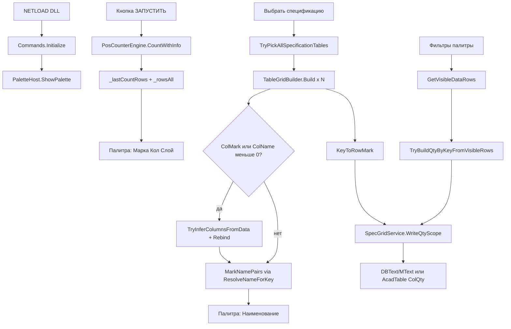

# Фактическая архитектура PosCounter.Net

Документ описывает **как программа реально работает** по текущему коду. Не ТЗ и не план будущих изменений.

**Версия:** 4.2.0-table-grid-lines (палитра: **POS COUNTER v4.2.0**)  
**Актуализация:** 2026-06-17

**Сборки:**

| AutoCAD | Framework | Папка |
|---------|-----------|-------|
| 2016–2024 | net46 | `dll 2016\` (+ `System.ValueTuple.dll`) |
| 2025+ | net8.0-windows | `dll 2026\` |

---

## 1. Общая схема

**Связь модулей:** номер марки (`Key`).

- **ЗАПУСТИТЬ** → количество в палитре (все строки подсчёта).
- **Выбрать спецификацию** → наименование в палитру + запись **«Кол.»** на чертёж **только из видимых строк палитры** (после фильтров).

---

## 2. Точка входа и команды

| Файл | Роль |
|------|------|
| `Commands.cs` | `IExtensionApplication`: NETLOAD, POSC, служебные POSC2_* |
| `PaletteHost.cs` | WPF-палитра, очереди команд, `TryBuildQtyByKeyForWriteback` |
| `UI/PosCounterControl.xaml.cs` | Кнопки, таблица, фильтры, экспорт, **Сброс** |

### Команды AutoCAD

| Команда | Кто вызывает | Действие |
|---------|--------------|----------|
| `NETLOAD` | инженер | `Initialize()` → на `Idle` открывается палитра; CMD `[POSC] … загружен` |
| `POSC` | инженер | `PaletteHost.ShowPalette()` |
| `POSC2_RUN_INTERNAL` | палитра «ЗАПУСТИТЬ» | `PosCounterEngine` → `_lastCountRows`, `_rowsAll` |
| `POSC2_SPEC_INTERNAL` | «Выбрать спецификацию» | pick → Build → имена → qty writeback |
| `POSC2_HIGHLIGHT_INTERNAL` | «Показать на чертеже» | transient-подсветка handles |

Старый LISP `pos_counter_2016_2026.lsp` **не используется** — только NETLOAD .NET DLL.

---

## 3. Палитра UI

### Кнопки

| Кнопка | Действие |
|--------|----------|
| **ЗАПУСТИТЬ** | подсчёт выносок → таблица палитры |
| **Выбрать спецификацию** | рамки таблиц → имена + «Кол.» на DWG |
| **Сброс** | `ResetPaletteState()`: `_lastCountRows`, `_rowsAll`, `_lastMarkNames`, `SpecGridSession.ClearScopes()`, фильтры, `InitGridView()` |

### Фильтры (Марка / Наименование / Количество / Слой)

- `PassesFilter` → `GetVisibleDataRows()` — что **видно** в таблице.
- Подсчёт заново **не делают**.
- **Влияют на запись «Кол.»:** `TryBuildQtyByKeyFromVisibleRows` суммирует `Count` только по видимым строкам.

### Редактирование наименования

- Ячейка «Наименование» в палитре редактируема.
- Правки попадают в экспорт и не затираются повторным «Выбрать спецификацию» для той же строки.

### Статус

- Итог операций — **строка внизу палитры** (OK / ошибка / сколько «Кол.» записано).

---

## 4. Модуль 1 — подсчёт выносок (`PosCounterEngine`)

**Файл:** `Engine/PosCounterEngine.cs` (**PALETTE-COUNT-LOCK — не менять без ТЗ**)

| Аспект | Факт |
|--------|------|
| Источник | выделение **или** галочка «Все объекты в модели» |
| Типы | `DBText`, `MText`, атрибуты блоков (рекурсия) |
| Не обрабатывается | `MLeader`, proxy СПДС |
| Марка | `ExtractPositionNumber` — цифры 1..10000; приставки «Поз.», «№»… |
| Группировка | `(слой, текст)` → `Quantity` |
| Слой | `MTextPlainText.ResolveLayer` — слой `0` → слой блока; xref `\|` отрезается |

Результат в `ApplyRunResult`: `_lastCountRows` (снимок) + `_rowsAll` (`PosRowVm` для UI).

---

## 5. Модуль 2 — спецификация (orchestration)

**`SpecGridService.RunSelectSpecification(doc, qtyByKey, log)`:**

1. `PaletteHost.TryBuildQtyByKeyForWriteback` → `qtyByKey` из **видимых** строк (до pick).
2. `TryPickAllSpecificationTables` — N рамок; Enter без выделения = конец.
3. Для каждой рамки `TableGridBuilder.Build(i, ids, tr, sharedGridLayer, log)`.
4. Если `ColMark < 0` **или** `ColName < 0` → **`TryInferColumnsFromData(scope, qtyByKey)`** → `RebindScopeKeysAndNames` + `FillMarkNamesFromMergeGroupsPublic`.
5. `SpecGridSession.SetScopes` → `MergeScopeNames` → `BuildCombinedMarkNames` → палитра.
6. `WriteQtyInTransaction` → `WriteQtyScope` / `WriteQtyScopeNativeTable`.
7. `CollectMissingQtyMarks` → CMD `[POSC] Количество не найдено в палитре…`.

`SharedGridLayer` — слой сетки первой таблицы для стабильности 2+ рамок на листе.

---

## 6. Выбор пути Build

| Условие выборки | Путь |
|-----------------|------|
| есть `Table`, нет `Line` | **`BuildFromAcadTable`** |
| есть `Line` (с Table или без) | **LINE path** |
| Table + Line вместе | LINE path (сообщение Mixed — **закомментировано** в CMD) |

---

## 7. LINE path — `TableGridBuilder.Build()`

**Файл:** `SpecGrid/TableGrid.cs`

### 7.1. Сбор и сетка

- LINE → `GridLineSeg`; DBText/MText → `TextSample`.
- `AutoDetectGridLayer` (≥30%, `MinGridLineLen=5000`).
- `BuildMergedGridAxes` — Y **сверху вниз** (`sortAsc: false`).
- Mixed layers → дополнение осей; CMD `[POSC] Сетка: линии на разных слоях…`.
- Лимиты: `MaxLines/Texts=20000`, `MaxCells=5000`.

### 7.2. Pass 1 — шапка

| # | Метод | Назначение |
|---|-------|------------|
| 1 | `AssignCellsHeader` | Row/Col по HeaderX/Y = ExtentsCenter |
| 2 | `BuildCellMatrix(false)` | CellText, все слои |
| 3 | `EstimateHeaderEndRow` | H-линии / первая марка (minRow=0) |
| 4 | **`ApplyHeaderBoundaryFromGridScan`** | скан строк → `HeaderEndRow` / `RowDataStart` |
| 5 | **`DetectHeader`** | grid rows → columns → top-band (last-resort) |
| 6 | `ComputeRowDataStart(null)` | searchFrom из grid scan; `ClampRowDataStartToGridScan` |
| 7 | `BuildPrimaryNameLayer`, `BuildTableContentLayers` | слои ColName / allowed |

### 7.3. Pass 2 — данные + KV

| # | Метод | Назначение |
|---|-------|------------|
| 8 | `AssignCellsData` | DataX/Y; Row по точке; DominantRow |
| 9 | `SplitNameColumnRowsData` | MText+DBText в одной ячейке NAME |
| 10 | `BuildTextsByRow` | кэш ColName по Row |
| 11 | `BuildCellMatrix(true)` | CellText, filtered layers |
| 12 | `ComputeRowDataStart(filteredH)` | уточнение RowDataStart |
| 13 | **`BindKeysFromProperties`** | `KeyToRowMark` |
| 14 | `BindKeys` | `KeyToRowTopSub`, `KeyToMarkBlockEnd` |
| 15 | `AlignRowDataStartToFirstMark` | min KeyToRowMark |
| 16 | **`RebindScopeKeysAndNames`** | pass2: DetectHeader **если не** `ColumnsInferredFromData` |
| 17 | **`FillMarkNamesFromMergeGroups`** | `MarkNamePairs` через **`ResolveNameForKey`** |

### 7.4. Fallback столбцов — `TryInferColumnsFromData`

Когда шапка не дала ColMark и/или ColName:

- Пересечение марок в данных с ключами **`qtyByKey`** из палитры.
- `ColumnsInferredFromData = true`.
- `RebindScopeKeysAndNames` **не** вызывает повторный `DetectHeader` (стабильность AC 2016).
- В CMD: суффикс `(столбцы по данным)` в строке «Распознана шапка».

---

## 8. Распознавание шапки

### 8.1. Граница шапки / данных — grid scan

- **`FindFirstDataRowByGridScan`**: первая data-строка — марка (`TryParseMarkKey`) или наименование+qty.
- `HeaderEndRow = RowDataStart = firstDataRow`.
- **Единый алгоритм** для всех таблиц.

### 8.2. Столбцы — порядок `DetectHeader`

1. **`DetectHeaderByGridRows`** — scoring; **`ScoreQtyHeader`** (без «ед», штраф «масса»); `SanitizeColQtyColumn`; `RefineColMarkByDataMarks`.
2. **`DetectHeaderByColumns`** — fallback по ячейкам.
3. **`DetectHeaderByTopTextBand`** — last-resort: полоса maxY−2000, `Row < HeaderEndRow`.

`EnsureUniqueHeaderColumns`: **Марка → Кол. → Наименование**.

### 8.3. RowDataStart

- Без принудительного min row 2.
- `ClampRowDataStartToGridScan` — марка 1 на row 1 не пропускается.

---

## 9. Ключ (марка) — LINE path

**`BindKeysFromProperties`** + **`IsBindableDataText`:**

- `t.Row >= RowDataStart`.
- Запасной Y: `DataY < ResolveDataYCutoff` = `GridYs[RowDataStart]`.
- `IsTextInColumnXBand(ColMark)`, `TryParseMarkKey`, не `IsSectionHeaderRow`.
- Bleed: `t.Col != ColMark` и длина > 4 → skip.

**Границы:** `BindKeys` → `KeyToRowTopSub`, `KeyToMarkBlockEnd`, `GetNextKeyRowMarkExclusive`.

---

## 10. Значение (наименование) — `ResolveNameForKey`

**Точка входа:** `FillMarkNamesFromMergeGroups` → **`ResolveNameForKey(key)`** (LINE, native Table, N scopes).

### 10.1. Диапазон строк

- `ResolveNameRowTopForKey`: `≥ HeaderEndRow`, `≥ RowDataStart`, skip секций.
- **`ResolveNextMarkBoundaryExclusive`** (2026-06-17): `rowEndExclusive = min(markBlockEnd, min(nextKeyTop, nextMarkRow))`; `FinalizeMarkBlockEndExclusive` в `GetMarkBlockEndExclusive`.
- **`IsNameContinuationRow`** — вторая строка имени не режется как секция.

### 10.2. Сбор имени

1. **`CollectNamePartsFromCellText`** — `TryAddNamePartExact`.
2. Если `cellJoined.Length ≥ 20` → **cell-only** (без AllTexts).
3. Иначе dual-pass: `CollectNamePartsForPositionRange` + `SupplementNamePartsInVerticalBand` + `FilterTextPartsNotInCellText`.
4. **`CollapseDuplicateNamePhrase`** — «A A» → «A».
5. Fallback: `CellText`, соседние col ±1.

### 10.3. Anti-bleed

- **Граница merge-марок (2026-06-17):** `ResolveNextMarkBoundaryExclusive` — обрезка по `nextKeyTop` (верх merge следующей марки), не по `nextMarkRow+1`. План: `plans/fix_merge_mark_boundary.md`.
- **`NameTextBelongsToMarkKey`** / `ResolveOwnerMarkKeyForNameText` — owner при dual-pass.
- **`ReportMergeBoundaryBleedWarnings`** — `[POSC] ВНИМАНИЕ …` в CMD при остаточном bleed (лимит 25 строк).
- Логи `[NAME-*]`, `[KV-PAIR]` в CMD **отключены** (`log.Info` — no-op).

### 10.4. Dedupe

- `IsDuplicateCandidate` — near-overlap MText+MText в ColName.

---

## 11. Native AutoCAD Table — `BuildFromAcadTable`

1. `CellText` из `table.Cells[r,c].TextString`.
2. `DetectHeaderFromCellMatrix`.
3. `RowDataStart` — первая марка в ColMark.
4. `BindKeysFromAcadTableCellMatrix`.
5. `FillMarkNamesFromAcadTableCells` → `ResolveNameForKey`.
6. Qty: **`UpsertQtyInAcadTable`** (число в «5 шт.» → «12 шт.»).

**Не вызываются:** AssignCellsData, dual-pass AllTexts (LINE-only).

---

## 12. Геометрия TextSample

| Поле | Pass-1 | Pass-2 |
|------|--------|--------|
| HeaderX/Y | ExtentsCenter | — |
| DataX/Y | — | DBText: точка; MText: X=Location.X, **Y=YMax** |
| Row/Col | по Header | по DataX/Y + DominantRow |
| YMin/YMax | экстент | экстент |
| BoundsMethod | ExtentsTop / Location / AlignmentPoint | для AC 2016: `TryGetMTextBounds` + GetBoundingPoints |

---

## 13. Запись «Кол.»

| Шаг | Метод | Факт |
|-----|-------|------|
| Источник qty | `TryBuildQtyByKeyFromVisibleRows` | **не** `_lastCountRows` |
| Точка вставки | `ResolveQtyInsertPoint` | центр ColQty по сетке |
| Merged ячейка | `ResolveQtyCellRowBottomExByColQtyGrid` | cap `ResolveNextKeyRowTopEx` |
| Стиль | `ResolveQtyTableTextAppearanceForScope` | ColQty → body → 2.5 |
| Update | `UpsertQtyText` / `UpsertQtyInAcadTable` | примечания инженера **не удаляются** |

**На чертёж пишется только ColQty.** Наименование в DWG не перезаписывается.

- Точка: `ResolveQtyInsertPoint` — Y = `(GridYs[rowTop]+GridYs[rowBottomEx])/2` (при пометках инженера).
- Цвет: `TryFillQtyAppearanceFromNameColumn` — из ColName (`PrimaryNameLayer`), не из пометки в ColQty.
- Merged ColQty: `ResolveQtyCellRowBottomExByColQtyGrid`.
- Стиль: `ResolveQtyTableTextAppearanceForScope(tr, scope, rowTop, rowBottomEx)`.

---

## 14. Логи CMD (инженер)

Файлов на диск **нет**. `[POSC-DIAG]` и `[NAME-*]` **отключены** (`SpecGridLog.WriteDiag` — no-op).

| Когда | Активные теги |
|-------|----------------|
| NETLOAD | `[POSC] PosCounter.Net … загружен` |
| Выбор рамок | `[INFO] Выбрана таблица …`, `Всего выбрано таблиц: N` |
| Спецификация | `[POSC] Распознана шапка…`, `Граница шапки/данных…`, `KeyToRowMark…` |
| Итог qty | `[POSC] WriteQty итог: записано=…` |
| Проблемы | `[POSC] Количество не найдено в палитре…`; колонка/сетка не распознана; марки в «Поз.» не найдены |

Подробнее: `docs/INSTRUCTION_ENGINEER.md` §8.1.

---

## 15. Вспомогательные модули

| Файл | Назначение |
|------|------------|
| `CellIndex.cs` | TryGetCellIndex, GetCellText, GetDominantRow, IsDuplicateCandidate |
| `MTextPlainText.cs` | санитизация, TryParseMarkKey, NameScore, section/standalone |
| `SpecGridLog.cs` | `WriteCommandLine`, `WriteEngineerSummary`, `WriteDiagTail`; `WriteDiag` off |
| `SpecGridSession.cs` | scopes, SharedGridLayer |
| `ExportService.cs` | Excel/CSV (4 колонки) |
| `PosSettingsStore.cs` | настройки UI |

---

## 16. Сборка и деплой

| AutoCAD | Скрипт | Результат |
|---------|--------|-------------|
| 2016–2024 | `build\build-ac2016.cmd` или `PosCounter.Net\build\build-ac2016.cmd` | `dll 2016\` (2 файла) |
| 2025+ | `build\build-ac2026.cmd` | `dll 2026\PosCounter.Net.dll` |

Props: `build\AutoCAD.props` (`AutoCADSdkDirNet46`, `AutoCADSdkDirNet8`).

Портативный kit AC 2016: `PosCounter.Net\Directory.Build.props` + `PosCounter.Net\build\`.

---

## 17. Красные зоны (не ломать без ТЗ)

- `PosCounterEngine` — PALETTE-COUNT-LOCK.
- `BuildMergedGridAxes`, порядок GridYs desc.
- Pass-1 шапка: `AssignCellsHeader`, grid scan, `DetectHeader*`.
- Qty writeback — **только видимые** строки (`TryBuildQtyByKeyFromVisibleRows`).
- При `ColumnsInferredFromData` — не сбрасывать столбцы повторным `DetectHeader` в `RebindScopeKeysAndNames`.

---

## 18. Чеклист ручной проверки

| # | Кейс | Ожидание |
|---|------|----------|
| H | любая таблица | CMD «Распознана шапка», ColMark/ColName/ColQty |
| 1 | **Ушко** | `RowDataStart=1`, `KeyToRowMark: 1→row1`, ColQty = «Кол.» |
| Qty | фильтр слоя в палитре | в «Кол.» на DWG — сумма **видимых** строк, не всех |
| 64 | **_tex_fek** | одно имя без дубля |
| 52 | _tex_fek | многострочное имя (dual-pass) |
| 4/5 | _tex_fek | mark 5 без текста mark 4 (owner mark) |
| 35NK | большая спец. | шапка DBText/MText |
| AC2016 | net46 DLL | NETLOAD `(net46)`; оба DLL в `dll 2016\` |
| CMD | любой чертёж | нет потока `[POSC-DIAG]` |

---

## 19. История актуализаций (кратко)

| Дата | Изменение в коде |
|------|------------------|
| 2026-06-09 | grid scan шапки, `ResolveNameForKey`, native Table, fix row1 |
| 2026-06-10 | AC 2016 net46 kit, `TryInferColumnsFromData`, MText bounds |
| 2026-06-17 | qty из **видимых** строк палитры (`PaletteHost` → `TryBuildQtyByKeyFromVisibleRows`) |
| 2026-06-17 | CMD: только `[POSC]`/`[INFO]` для инженера; `[POSC-DIAG]` отключён |

---

## 20. Связанные документы

| Документ | Аудитория |
|----------|-----------|
| `docs/DEVELOPER.md` | разработчик — методы и условия |
| `docs/INSTRUCTION_ENGINEER.md` | инженер — пошаговая работа |
| `Работа программы.md` | все — Q&A простым языком |
| `docs/BUILD.md` | сборка DLL |
| `.cursor/DIALOGUE_LOG.md` | история правок и неудачных попыток |

**Единственный план архитектуры:** этот файл (`.cursor/plans/factual_program_architecture.plan.md`).
