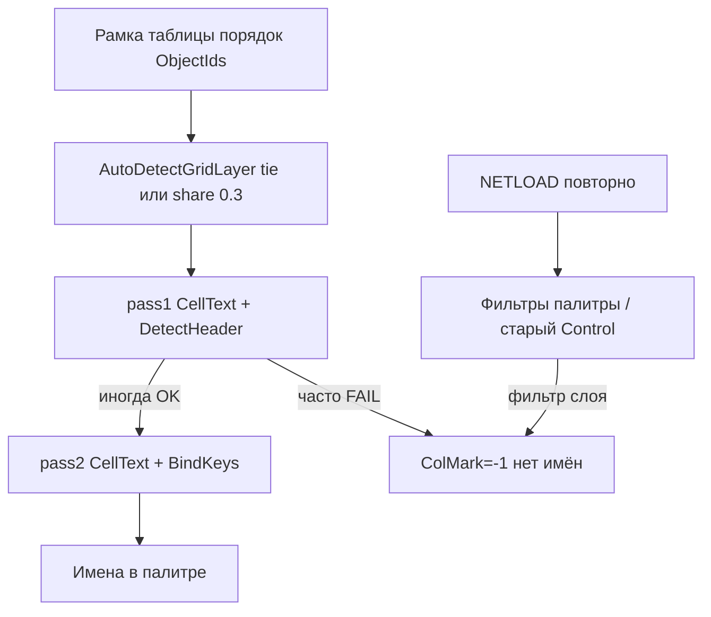

# Исправление нестабильного распознавания спецификации (AC 2016 и AC 2026)

## Совместимость AutoCAD 2016 и 2026

**Да — план работает для обеих версий.** Все правки в **общем** коде [`PosCounter.Net`](PosCounter.Net/) (`TableGrid.cs`, `SpecGridService.cs`, `PaletteHost.cs`, `PosCounterControl`, `ExportService.cs`). Отдельной логики «только для 2016» нет.

| Версия AutoCAD | Сборка | DLL | Скрипт |
|----------------|--------|-----|--------|
| **2016 – 2024** | `net46` | `dll 2016\PosCounter.Net.dll` | `build\build-ac2016.cmd` |
| **2025 – 2026+** | `net8.0-windows` | `dll 2026\PosCounter.Net.dll` | `build\build-ac2026.cmd` |

Название плана с «AC2016» — потому что баг воспроизвели на **2016**; алгоритм распознавания шапки и палитры **один и тот же** в обеих DLL.

**Ограничение:** после правок нужно собрать **обе** целевые платформы (или ту, которой пользуетесь) и загрузить **свою** DLL через NETLOAD — изменения в исходниках сами в AutoCAD не попадут.

## Симптом (от инженера)

На **одном и том же чертеже** после нескольких **NETLOAD** спецификация **иногда распознаётся**, а **иногда нет** — без явного изменения чертежа. Это указывает на **недетерминизм в коде**, а не только на «неправильную рамку».

---

## Подтверждённые причины нестабильности в коде

### 1. Шапка определяется на pass1, ключи — на pass2 (главный баг)

В [`TableGridBuilder.Build`](PosCounter.Net/SpecGrid/TableGrid.cs):

```text
pass1: AssignCellsHeader → CellText → DetectHeader()   ← ColMark/ColName/ColQty
pass2: AssignCellsData  → CellText → BindKeys()        ← KeyToRowMark, имена
```

`DetectHeader` читает ячейки с **header-координатами** (pass1). `BindKeys` и имена работают с **data-координатами** (pass2). При смещении текста между проходами шапка может «пропасть», хотя данные в pass2 корректны — или наоборот. От перезагрузки/сетки/слоя зависит, совпадут ли проходы → **то работает, то нет**.

**Исправление:** после строки `result.CellText = BuildCellMatrix(..., filterTableLayers: true)` **повторно** вызвать:
- `ApplyHeaderBoundaryFromGridScan`
- `DetectHeader`
- `ComputeRowDataStart`
- затем `BindKeys…` / `FillMarkNames…` как сейчас

### 2. Нестабильный `AutoDetectGridLayer`

[`AutoDetectGridLayer`](PosCounter.Net/SpecGrid/TableGrid.cs) выбирает слой линий по `OrderByDescending(Count)`. При **равном Count** у двух слоёв победитель зависит от порядка обхода линий → порядок объектов в **рамке выделения** (меняется от раза к разу).

Порог `share < 0.3` → `gridLayer = null` (все слои) vs один доминирующий слой — **разная сетка**, разное попадание текстов в ячейки.

**Исправление:** tie-break `.ThenByDescending(x => x.Len)`; в CMD всегда писать `gridLayer=… share=…`.

### 3. `SharedGridLayer` со таблицы 1 на таблицу 2

В [`RunSelectSpecification`](PosCounter.Net/SpecGrid/SpecGridService.cs) вторая таблица строится с `sharedGridLayer` от первой. Если у таблиц **разные слои линий**, вторая таблица может строиться то с чужим слоем, то после rebuild — **разный результат** при двух таблицах в одном цикле.

**Исправление:** для каждой таблицы **свой** `AutoDetectGridLayer`; `SharedGridLayer` только как подсказка, не жёсткий фильтр, или отключить наследование при `MergedFromMixedLayers`.

### 4. Состояние палитры между NETLOAD

Статика [`PaletteHost`](PosCounter.Net/PaletteHost.cs) (`_palette`, `_control`) и фильтры в [`PosCounterControl`](PosCounter.Net/UI/PosCounterControl.xaml.cs) (`_filterLayer`) **не сбрасываются** при NETLOAD. [`SpecGridSession.ClearScopes`](PosCounter.Net/SpecGrid/SpecGridSession.cs) вызывается только внутри «Выбрать спецификацию» и «Сброс».

[`TryBuildQtyByKeyForWriteback`](PosCounter.Net/PaletteHost.cs) сначала берёт **видимые** строки (с учётом фильтра слоя) → при активном фильтре `qtyByKey` пустой/урезанный → будущий inference по палитре даст разный результат.

**Исправление:**
- для спецификации использовать **снимок всех строк** (`TryBuildQtyByKeyFromAllRowsSnapshot`), не видимых;
- в `Initialize()` после NETLOAD — `SpecGridSession.ClearScopes()` + опционально сброс фильтров или подсказка «нажмите Сброс»;
- защита от повторного `POSC2_SPEC_INTERNAL` пока идёт выбор рамок.

### 5. Цепочка при полном провале (ваш лог)

Даже при стабильном коде, если `ColMark=-1`:
- `BindKeysFromProperties` выходит сразу;
- `BuildCombinedMarkNames` пуст;
- CMD: «Марка — не найдена…».

В логе top-band содержит **данные** (`Тройник`, `ГОСТ`, массы), не заголовки — fallback по текстам даёт `score=0`.

**Исправление (fallback):** `TryInferColumnsFromData` + пересечение с ключами палитры после **ЗАПУСТИТЬ**.

---

## Диаграмма: почему «то да, то нет»



---

## Доработка кода (приоритет)

| # | Задача | Файлы |
|---|--------|-------|
| 1 | **Re-DetectHeader после pass2** | `TableGrid.cs` |
| 2 | Стабильный grid layer + CMD | `TableGrid.cs` |
| 3 | Не наследовать слой сетки слепо | `SpecGridService.cs` |
| 4 | qtyByKey из всех строк; guard spec command | `PaletteHost.cs`, `Commands.cs` |
| 5 | `TryInferColumnsFromData` + re-bind | `TableGrid.cs`, `SpecGridService.cs` |
| 6 | Успех шапки: ColMark+ColName (ColQty опционально для имён) | `TableGrid.cs` |
| 7 | CMD: «строка шапки не в выделении» / данные в top-band | `SpecGridService.cs` |
| 8 | Редактирование имени в палитре + экспорт | `PosCounterControl`, `ExportService.cs` |

**Не трогать:** `PosCounterEngine.cs` (LOCK).

---

## Для инженера до выхода патча

1. **NETLOAD** `dll 2016\PosCounter.Net.dll` (не LOAD lsp).
2. Перед тестом — **Сброс** в палитре (сброс фильтров и сессии).
3. **ЗАПУСТИТЬ** → **Выбрать спецификацию**; рамка **с строкой шапки** (Поз./Наименование/Кол.).
4. Снять **фильтр «Слой»**, если включён.
5. При повторном NETLOAD без перезапуска AutoCAD — закрыть палитру, **Сброс**, снова NETLOAD (избежать старого Control).

---

## Проверка после правок

| Тест | Ожидание |
|------|----------|
| **5× подряд** одна и та же рамка (2 таблицы) | одинаковый CMD: ColMark, ColName, KeyToRowMark |
| С фильтром слоя в палитре | результат как без фильтра (для spec) |
| Чертеж пользователя без шапки в рамке, после ЗАПУСТИТЬ | inference по палитре → имена |
| Ушко / 35NK | без регрессии |
| AC 2016 | `build-ac2016.cmd` → NETLOAD `dll 2016\` |
| AC 2026 | `build-ac2026.cmd` → NETLOAD `dll 2026\` |

---

## Связанные задачи

- Редактирование наименования в палитре + экспорт (запасной путь, если авто не сработало).
- Документация: `docs/INSTRUCTION_ENGINEER.md`, `Работа программы.md`, `.cursor/DIALOGUE_LOG.md`.
