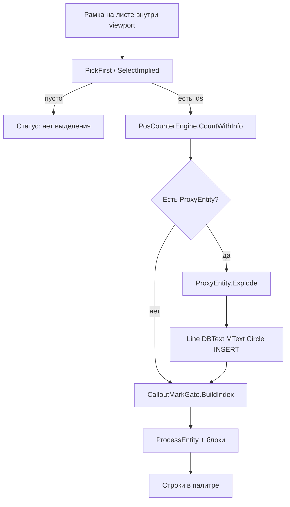

# План: выделение на листе, ЗАПУСТИТЬ и чертежи СПДС (proxy)

## Ваш сценарий (по скринам)

- Чертеж открыт на **листе** (`Лист4`, `Лист5`…), не на вкладке «Модель».
- Видовой экран **активен** (внизу подсвечено **MODEL**).
- Содержимое в **модели лежит в блоке**.
- На плане марки **1, 2, 3, 4 в кружках**; таблица «Спецификация» рядом.
- При открытии — предупреждение **SPDSExtApp** (модуль СПДС не установлен).
- Чертёж создан в **nanoCAD СПДС** / СПДС — оси, обозначения, таблицы часто являются **proxy-объектами**; на экране видны благодаря **PROXYGRAPHICS**.



---

## Диагноз: почему «не видит» и «не даёт запустить»

Сравнение с [`E:\Yandex.Disk-ananchenkoiren\TatbelGit\3\PosCounter.Net1`](E:\Yandex.Disk-ananchenkoiren\TatbelGit\3\PosCounter.Net1):

| Часть | Старый проект (3) | Текущий проект (— 2) | Вывод |
|-------|-------------------|----------------------|-------|
| Снимок выделения | `SelectImplied()` в `RequestRun` | **Тот же код** | Логика **не удалялась** |
| Разбор блоков | `ProcessBlockReference` | **Тот же** | Блок раскрывается |
| **Proxy СПДС** | **не обрабатывается** | **не обрабатывается** | Оба проекта **игнорируют** `ProxyEntity` |
| Фильтры выносок | `ExtractPositionNumber` | `CalloutMarkGate` + C4 круг | **Новое** после fix_mark_column_snap |
| Ошибки команды | `catch` без сообщения | `catch` без сообщения | Палитра **застревает** на «Подсчёт…» |

**Четыре независимые причины:**

1. **PickFirst теряется** при клике по палитре → статус *«Нет выделения…»*.
2. **Команда падает/зависает** в `CalloutMarkGate.BuildIndex` → кнопка «не отвечает».
3. **Выделение есть, марок 0** — C4 отсекает цифры в кружках; неверный статус в UI.
4. **В выделении только ProxyEntity СПДС** — программа **не заходит внутрь** proxy: ни TEXT, ни LINE не читаются → 0 марок и пустая спецификация, хотя на экране всё видно (PROXYGRAPHICS).

**Про СПДС (ваше уточнение):**

| Ситуация | Что видит инженер | Что видит программа сейчас |
|----------|-------------------|----------------------------|
| Модуль СПДС **не установлен** | Объекты на экране (PROXYGRAPHICS=1) | `ProxyEntity` в выделении, **без разбора** → пусто |
| Модуль **установлен** | Полноценные объекты СПДС | Зависит от типа; часто всё равно нужен **Explode** для LINE/TEXT |
| Таблица из **обычных** Line+DBText | Работает | Работает (как на тестовых DWG) |
| Таблица **целиком proxy** | Видна рамка и текст | **Не работает** без Explode |

Сейчас в [`DEVELOPER.md`](docs/DEVELOPER.md) и [`Работа программы.md`](Работа программы.md) явно: *«proxy СПДС не читаются»*. **Этот план меняет это** — добавляем чтение через **графическое представление** proxy (без установки модуля СПДС, если PROXYGRAPHICS включён).

---

## Что меняем (по приоритету)

### 1. Надёжный снимок выделения (главный фикс)

**Файлы:** [`PaletteHost.cs`](PosCounter.Net/PaletteHost.cs), [`PosCounterControl.xaml.cs`](PosCounter.Net/UI/PosCounterControl.xaml.cs)

- `PaletteHost.TrySnapshotPickFirst(Document doc)` — общий снимок.
- **`BtnRun.PreviewMouseDown`** — снимок до потери фокуса чертежа.
- В `PosCounterRunInternal`: если снимок пуст и галочка выкл. — повтор `TryResolveSelection`.
- CMD: `[POSC-DIAG] pick ctab=Лист4 cvport=2 count=47 sample=INSERT,ProxyEntity,DBText`

### 2. Защита от «зависшей» кнопки

**Файлы:** [`PosCounterEngine.cs`](PosCounter.Net/Engine/PosCounterEngine.cs), [`Commands.cs`](PosCounter.Net/Commands.cs)

- `BuildIndex` в `try/catch` → fallback `geoIndex = null`.
- В `catch` команды — `WriteMessage` + обновление палитры с `[ERROR] …`.
- Лимит глубины вложенности блоков в `BuildIndex`.

### 3. Понятные сообщения на листе

**Файлы:** [`PosCounterControl.xaml.cs`](PosCounter.Net/UI/PosCounterControl.xaml.cs), [`INSTRUCTION_ENGINEER.md`](docs/INSTRUCTION_ENGINEER.md)

- При `выделение` + 0 строк: *«Выделено N объектов, марок не найдено…»* + `DebugSummary`.
- Блок **«Работа на листе»** в инструкции (viewport MODEL, рамка, галочка).

### 4. Уточнение C4 (после диагностики)

**Файл:** [`CalloutMarkGate.cs`](PosCounter.Net/Engine/CalloutMarkGate.cs)

- Одиночный круг с голой цифрой на плане **не отбрасывать**, если нет C1/C3.

### 5. Поддержка proxy-объектов СПДС (новый блок)

**Новый файл:** [`PosCounter.Net/Engine/ProxyEntityHelper.cs`](PosCounter.Net/Engine/ProxyEntityHelper.cs)

Общий помощник (без ссылки на SPDS DLL — только AutoCAD API):

```csharp
// Псевдокод
bool TryCollectFromEntity(Entity ent, ..., int depth, List<WorkItem> sink)
{
    if (ent is ProxyEntity proxy)
    {
        var exploded = new DBObjectCollection();
        proxy.Explode(exploded);  // копии из graphics metafile (PROXYGRAPHICS)
        foreach (DBObject obj in exploded)
            TryCollectFromEntity(obj as Entity, ..., depth+1, sink);
        // Dispose exploded copies (не в БД)
        return true;
    }
    // обычные Line / DBText / MText / BlockReference — как сейчас
}
```

**Где подключить:**

| Модуль | Файл | Зачем |
|--------|------|-------|
| ЗАПУСТИТЬ | [`PosCounterEngine.cs`](PosCounter.Net/Engine/PosCounterEngine.cs) `ProcessEntity` | Марки из proxy-выносок и proxy-текста |
| Индекс C1–C4 | [`CalloutMarkGate.cs`](PosCounter.Net/Engine/CalloutMarkGate.cs) `CollectEntity` | LINE/Circle/TEXT внутри proxy |
| Спецификация | [`TableGrid.cs`](PosCounter.Net/SpecGrid/TableGrid.cs) `Build` (цикл по `objectIds`) | Линии сетки и текст в СПДС-таблице |

**Правила безопасности:**

- `MaxProxyExplodeDepth` = 5 (вложенные proxy/блоки).
- `MaxExplodedObjects` = 5000 на scope (защита от зависания).
- Exploded-объекты **не пишем в чертёж** — только читаем в памяти, затем `Dispose`.
- При `Explode` exception → лог `[POSC-DIAG] proxy explode-fail class=…` и продолжаем остальные объекты.

**Диагностика в CMD:**

```
[POSC-DIAG] proxy picked=12 exploded=ok lines=340 texts=28 fail=0
[POSC-DIAG] proxy explode-fail class=SPDSExtApp:… reason=no-graphics
```

**Статус палитры**, если в выделении только proxy и explode не удался:

*«Объекты СПДС (proxy): включите PROXYGRAPHICS=1 или установите модуль СПДС для AutoCAD»*

**Инструкция инженеру (СПДС):**

1. **PROXYGRAPHICS** = 1 (Настройки → Открытие и сохранение → «Отображать прокси-графику») — чтобы Explode имел геометрию.
2. **Желательно** Object Enabler / модуль **СПДС Extension for AutoCAD** — для полного редактирования; для **подсчёта и спецификации** достаточно Explode при п.1.
3. Если после NETLOAD в CMD `proxy picked>0` и `exploded=ok`, но марок 0 — прислать лог (возможен C4 или рамка не в viewport).

**Ограничения (честно):**

- Читаем **визуальное представление** proxy, не «умные» поля СПДС.
- Если PROXYGRAPHICS=0 и metafile пуст — Explode не даст LINE/TEXT; без модуля СПДС не помочь кодом.
- MLeader и нестандартные типы без графики — по-прежнему вне scope.

### 6. Документация и лог

- [`docs/DEVELOPER.md`](docs/DEVELOPER.md) — §4: PickFirst на листе, `ProxyEntityHelper`, убрать «не обрабатывается proxy» → «через Explode при PROXYGRAPHICS».
- [`Работа программы.md`](Работа программы.md) — раздел «СПДС» обновить.
- [`.cursor/DIALOGUE_LOG.md`](.cursor/DIALOGUE_LOG.md) + `_IMPLEMENTED.md`.

---

## Чеклист проверки в AutoCAD

### A. Лист + рамка (без СПДС-proxy)

1. NETLOAD свежей DLL.
2. Лист4 → двойной щелчок в viewport (MODEL).
3. Рамкой таблица → ЗАПУСТИТЬ → `pick count>0`, марки 1–4.
4. Рамкой план с кружками → после фикса C4 — марки в палитре.

### B. Чертёж СПДС (3SNK-MBV01, предупреждение SPDSExtApp)

5. PROXYGRAPHICS=1 → рамкой спецификация → **Выбрать спецификацию** → в CMD `proxy exploded=ok`, имена в палитре.
6. Рамкой выноски на плане → **ЗАПУСТИТЬ** → `proxy` + марки в палитре.
7. Если `explode-fail` — проверить PROXYGRAPHICS; при необходимости установить СПДС Extension.

### C. Регрессия

8. Обычный DWG без proxy — поведение как раньше.
9. Прислать CMD: `[POSC-DIAG] pick` + `proxy` + статус палитры.

---

## Что НЕ входит в этот план

- Изменения ColMark snap ([`fix_mark_column_snap_20bf4182.plan.md`](.cursor/plans/fix_mark_column_snap_20bf4182.plan.md) не трогаем).
- Прямая интеграция с API nanoCAD СПДС / ObjectARX SPDSExtApp (только стандартный `ProxyEntity.Explode`).
- `git commit` / `push` без вашего разрешения.
