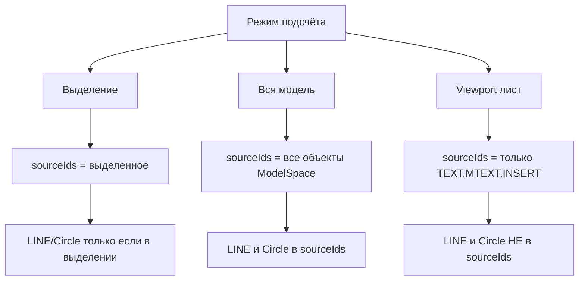
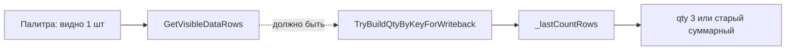
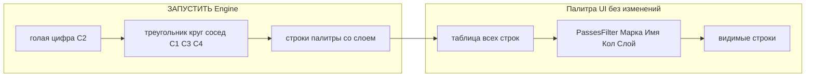
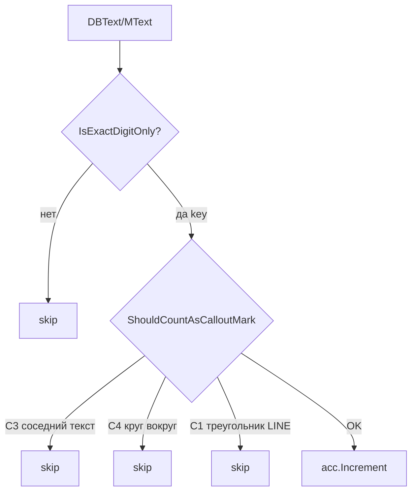

# План: ColMark snap + количество из палитры + фильтр выносок

## Статус на 2026-06-16 (по запросу пользователя)

- Часть **C** (фильтры выносок C1–C4) — **выполняется отдельным планом** и **возвращена в код**.
- Часть **B** (qty из видимой палитры) — **уже в коде**.
- Часть **A** (ColMark snap / спецификация) — **не делаем** в рамках текущего запроса: распознавание таблиц оставить как есть.

Три блока в одном релизе: **A** спецификация ColMark, **B** qty из палитры, **C** **дополнение** фильтров выносок (программа уже считает выноски — нужно отсеять ложные).

---

# Сверка плана с текущим кодом (факт, не догадки)

Проверено: [`PosCounterEngine.cs`](PosCounter.Net/Engine/PosCounterEngine.cs), [`PaletteHost.cs`](PosCounter.Net/PaletteHost.cs), [`MTextPlainText.cs`](PosCounter.Net/SpecGrid/MTextPlainText.cs).

## Как сейчас работает ЗАПУСТИТЬ

| Что | Сейчас в коде | План (дополнение) |
|-----|---------------|-------------------|
| Источник объектов | выделение / вся ModelSpace / viewport (только TEXT,MTEXT,INSERT,ATTRIB) | без изменения источника текста |
| Обработка | `ProcessEntity` → только DBText, MText, INSERT, ATTRIB | **добавить** второй проход: индекс LINE + Circle |
| Распознавание номера | `ExtractPositionNumber` — **снимает** префиксы `Поз.`, `№`, `Марка`… затем проверяет «только цифры» | **ужесточить в `ProcessTextValue`:** `IsExactCalloutDigitText` — **во всех режимах** (выделение / модель / viewport) |
| Слой | `GetBaseLayer` — **группировка** в палитре; UI `PassesFilter` по слою — **как сейчас** | C1–C4: слой **не** критерий; UI-фильтры **не трогать** |
| Геометрия текста | **не читается** (нет Position/Height в `ProcessTextValue`) | **добавить** точку и высоту текста для C1/C3/C4 |
| Треугольник LINE | **нет** — Line в `ProcessEntity` не обрабатывается | C1: индекс коротких LINE рядом с точкой текста |
| Круг Circle | **нет** — Circle не обрабатывается | C4: индекс Circle, точка внутри малого круга → skip |
| Соседний текст | **нет** | C3: второй TEXT в радиусе `searchR` |
| MText | сырой `mText.Contents` (с кодами форматирования) | C2: `MTextPlainText.SanitizeRawContents` перед проверкой |
| `IsExactDigitMark` | есть в SpecGrid, **не вызывается** из Engine | C2: использовать в Engine |

## Что уже отсекается без доработки

`ExtractPositionNumber` уже **не** считает:

- `дет.3`, `А-3` — символы `.`, `-` в `InvalidChars`;
- `3 шт` — не все символы цифры.

## Что сейчас **считается**, но по плану **не должно** (C2)

- `Поз. 3`, `№ 52` — префикс снимается → остаётся голая цифра → **считается**. Пользователь: **только числа** → после C2 **не** считать.

## Важный разрыв: LINE/Circle при разных режимах



**Решение для C1/C4 (дописать в реализацию):**

1. **Вся модель** — второй проход по тем же `sourceIds`: собрать `Line` + `Circle` (уже все в ModelSpace).
2. **Выделение** — индекс LINE/Circle из `sourceIds`; если треугольник/круг **не** выделен — фильтр не сработает (ограничение режима; в CMD предупреждение не обязательно).
3. **Viewport** — расширить `SelectionFilter` в `TrySelectInViewportPolygon`: добавить `LINE,CIRCLE` **или** отдельный crossing-polygon только для геометрии в том же viewport.

Текстовый проход — как сейчас; геометрический индекс — **отдельно**, не через `ProcessEntity` для Line.

## Часть B — подтверждено в коде

[`PaletteHost.TryBuildQtyByKeyForWriteback`](PosCounter.Net/PaletteHost.cs) строка 225: `TryBuildQtyByKeyFromAllRowsSnapshot()` → `_lastCountRows`.  
Правильный метод [`TryBuildQtyByKeyFromVisibleRows`](PosCounter.Net/UI/PosCounterControl.xaml.cs) есть, **не подключён**.

## Часть A — в коде **нет**

`SnapExactDigitMarksToColMark`, расширенный фильтр ОСТ в ColMark — только в плане, не реализовано.

---

# Часть A. Универсальная привязка цифр к столбцу ColMark

## Принцип (обязательно)

- **Автоматически** для **каждой рамки** (scope): своя сетка, свой `ColMark`, без `key==N`, без координат чертежа.
- На листе **много разных таблиц** — каждая обрабатывается отдельно при своей рамке.

## Диагноз (класс ошибки)

1. Точка `AlignmentPoint` короткой цифры мимо узкого ColMark → цифра не в bucket ColMark.
2. Обозначение ОСТ/ГОСТ в bucket ColMark → `CellText[colMark]` не цифра → `markAnchor` находит не первую строку.
3. `RowDataStart` сдвигается → марки и имена теряются.

Пример: «1» X=481,95 не в ColMark; «4» X=483,39 — в ColMark (разница ~1,4 мм, граница сетки между ними).

## Решение A

### A1. `SnapExactDigitMarksToColMark` ([`TableGrid.cs`](PosCounter.Net/SpecGrid/TableGrid.cs))

После `AssignCellsHeader` (pass 1) и `AssignCellsData` (pass 2), до `BuildCellMatrix`.

- Кандидат: `MarkKeyParser` + `IsExactDigitMark` (любой номер 1..10000).
- `snapEps = max(CellIndexEps, colWidth * 0.25)`, `colWidth` из `GridXs[ColMark]` **этого scope**.
- Попадание: `AlignX` или центр X-экстента (`XMin`/`XMax` в `TextSample`).
- Строка: `Row` или `DominantRow`.
- Действие: `t.Col = ColMark`.

### A2. Фильтр обозначений в ColMark

- Расширить `LooksLikeDesignationText`: ОСТ, OST, `\d+\s+ОСТ` и т.д.
- [`CellIndex.GetCellText`](PosCounter.Net/SpecGrid/CellIndex.cs) при `preferMarkColumn`: без designation, затем prefer exact-digit.

### A3. `FindFirstMarkRowFromAllTexts`

- Та же полоса `snapEps`; `DominantRow` при `Row < 0`.
- `min(row)` с exact-digit — без привязки к значению key.

---

# Часть B. «Кол.» пишется не из палитры (первый раз неверно)

## Симптом (ваш тест)

- Палитра: марка **1**, количество **1** (скрин 1).
- Галочка «Все объекты в модели» **выключена** — подсчёт по выделению.
- Первый «Выбрать спецификацию» → в «Кол.» на чертеже **не 1** (на скрине 2 в ячейке **3**).
- Второй раз — вставляется **правильно**.

## Диагноз (код)

Сейчас [`PaletteHost.TryBuildQtyByKeyForWriteback`](PosCounter.Net/PaletteHost.cs) вызывает:

```csharp
control.TryBuildQtyByKeyFromAllRowsSnapshot();  // ← _lastCountRows
```

Метод [`TryBuildQtyByKeyFromAllRowsSnapshot`](PosCounter.Net/UI/PosCounterControl.xaml.cs) суммирует **`_lastCountRows`** — снимок на момент последнего **ЗАПУСТИТЬ**, **без учёта фильтров** и **без текущего состояния таблицы**.

Уже есть правильный метод — [`TryBuildQtyByKeyFromVisibleRows`](PosCounter.Net/UI/PosCounterControl.xaml.cs) (`GetVisibleDataRows()` + `PassesFilter`), но он **не используется** для WriteQty.



**Почему «со второго раза»:** после первого выбора спецификации обновляются имена, сетка, иногда фильтры/строки; повторный проход совпадает с ожиданием — но это **не гарантировано**, корень в неверном источнике qty.

**Расхождение документации:**

| Документ | Что написано |
|----------|--------------|
| [`Работа программы.md`](Работа программы.md) | сумма по **видимым** строкам |
| [`docs/DEVELOPER.md`](docs/DEVELOPER.md) §14 | qty из **видимых** строк |
| [`docs/DEVELOPER.md`](docs/DEVELOPER.md) §20 | **все** `_lastCountRows`, фильтры не режут |
| Реализация | **все** `_lastCountRows` |

Для инженера: **в «Кол.» должно попадать то, что видно в палитре** (как в Q&A).

## Решение B

### B1. Источник qty для WriteQty

В [`PaletteHost.TryBuildQtyByKeyForWriteback`](PosCounter.Net/PaletteHost.cs):

- заменить `TryBuildQtyByKeyFromAllRowsSnapshot()` на **`TryBuildQtyByKeyFromVisibleRows()`**;
- если видимых строк 0 — не писать qty (как сейчас при пустом словаре).

Суммирование по марке — только по **видимым** строкам `_rowsAll` после `PassesFilter` (Марка / Наименование / Количество / Слой).

### B2. Снимок в момент клика

В [`BtnSelectSpec_OnClick`](PosCounter.Net/UI/PosCounterControl.xaml.cs) или в начале `TryBuildQtyByKeyForWriteback`:

- собирать qty **на UI-потоке** сразу перед `SendStringToExecute` / в `POSC2_SPEC_INTERNAL`;
- не полагаться на отложенный снимок `_lastCountRows` от прошлого ЗАПУСТИТЬ.

Опционально: убрать дублирование — `TryBuildQtyByKeyFromAllRowsSnapshot` оставить только для диагностики или удалить, если нигде не нужен.

### B3. Диагностика CMD

При WriteQty добавить одну строку (через `SpecGridLog`):

`[POSC-DIAG] qty source=visible keys=N sample: 1→1, …`

Чтобы инженер видел, **какие числа** ушли в спецификацию.

### B4. Согласовать документацию

- [`docs/DEVELOPER.md`](docs/DEVELOPER.md) §20 — убрать противоречие: qty = **видимые** строки.
- [`docs/INSTRUCTION_ENGINEER.md`](docs/INSTRUCTION_ENGINEER.md) §4 — уточнить: фильтры **влияют** на запись «Кол.» (как в палитре).

**Не менять:** логику группировки `(слой + текст)` в Accumulator; **UI-фильтры палитры** (`PassesFilter` по Марка/Наименование/Количество/Слой).

---

# Часть C. Дополнение фильтров выносок (основа уже работает)

**Задача пользователя:** выноски с голой цифрой уже распознаются правильно; **дополнить** отсевом:

1. цифра **не одна** в тексте (что-то до/после) — не выноска;
2. рядом **треугольник** из LINE — не выноска;
3. цифра **в круге** — не выноска;
4. рядом на полке **другой текст** с буквами — не выноска.

**Не переписывать** подсчёт с нуля — вставить gate **перед** `acc.Increment` (PALETTE-COUNT-LOCK).

Общий принцип: **автоматически**, по содержимому текста и геометрии рядом — **без** `key==N`, **без привязки к слою** при решении «это выноска или нет», без координат чертежа.

### Два уровня — не путать (важно для инженера)

| Уровень | Где | Слой | Что делаем |
|---------|-----|------|------------|
| **Подсчёт (C1–C4)** | `PosCounterEngine` при ЗАПУСТИТЬ | **не проверяем** | Только **голая цифра** + геометрия рядом (треугольник, круг, соседний текст). Признаки C1/C3/C4 сами говорят: цифра **не самостоятельная выноска**, **независимо от слоя** объекта. |
| **Палитра (UI)** | `PosCounterControl`, `PassesFilter` | **как сейчас** | Фильтры инженера: **Марка**, **Наименование**, **Количество**, **Слой** (`BtnFilterLayer`, чекбоксы) — **не менять**. Инженер по-прежнему сужает **видимые строки** в таблице палитры. |



**Часть C не трогает UI-фильтры.** Меняется только то, **какие строки попадают** в палитру после ЗАПУСТИТЬ (меньше ложных марок). Фильтр по слою в палитре остаётся **опциональным инструментом инженера** — как сейчас.

**Слой нигде не участвует в фильтрах C1–C4:** ни `TM_текст`, ни `0`, ни любой другой — только содержание текста и геометрия рядом.

**Главное правило выноски (C2):** если в **одном** текстовом объекте до цифры или после цифры есть **любой** символ (буква, точка, пробел, «Поз.», «шт»…) — это **не выноска**, **независимо от слоя** этого текста.

**C2 — во всех режимах одинаково (обязательно):** отсев «не только число» действует **везде**, без исключений:

| Режим ЗАПУСТИТЬ | C2: только голая цифра |
|-----------------|------------------------|
| Выделение (галочка «вся модель» выкл.) | **да** — каждый TEXT/MText из выделения |
| Вся модель (галочка вкл., вкладка Model) | **да** — каждый текст из ModelSpace |
| Viewport на листе (галочка вкл., активный VP) | **да** — каждый TEXT/MTEXT из viewport |

Проверка C2 в **`ProcessTextValue`** — общий путь для всех режимов; **не** зависит от того, как собран `sourceIds`. Режим влияет только на **набор объектов**, а не на правило «считать только число».

*Отличие:* геометрические фильтры C1/C3/C4 могут видеть LINE/Circle не во всех режимах (см. «Сверка с кодом») — но **текстовый** фильтр C2 обязан работать **всегда**.

Точка вставки: [`PosCounterEngine.cs`](PosCounter.Net/Engine/PosCounterEngine.cs) — единый gate `bool ShouldCountAsCalloutMark(...)` **перед** `acc.Increment` (PALETTE-COUNT-LOCK: не менять `Accumulator` и группировку).



**Важно:** для выносок **не** использовать снятие префиксов `Поз.` / `№` — только **голая цифра** (скрин 1). Префиксы остаются только в спецификации (SpecGrid).

---

## C1. Треугольник из LINE рядом (ваши скрины)

**Смысл:** треугольник из коротких LINE рядом с цифрой = цифра **не самостоятельная выноска** (как маркер узла/детали), **независимо от слоя** LINE и текста.

- Рядом с полкой — **треугольник из 3 отрезков** (на чертеже часто слой 0, длины ~3–4,6 мм) — **слой LINE не проверяем**.
- На полке — TEXT «3» → сейчас всегда считается маркой.

### C1. Подготовка — индекс отрезков

- собрать все `Line` → список `LineSeg` (x1,y1,x2,y2, length);
- не требовать, чтобы линии были «выделены вместе с текстом» при подсчёте всей модели; при выделении — только LINE из выделения (как сейчас для entity).

### C1. Проверка треугольника

Метод `HasAdjacentLineTriangleMarker(textPt, textHeight, lines)`.

Параметры **от высоты текста** (не от чертежа):

| Параметр | Формула | Пример при h=2,5 |
|----------|---------|----------------|
| Радиус поиска `searchR` | `max(5 * h, 12)` | 12,5 |
| Макс. сторона `maxLeg` | `max(8 * h, 30)` | 30 |
| Допуск вершины `vertexEps` | `max(h * 0.5, 1)` | 1,25 |

Шаги: короткие LINE в круге `searchR` → ≥3 отрезка, 3 вершины, замкнутый микро-контур (как скрины 3–5). Упрощение: ≥3 коротких LINE, все концы в `searchR * 1.2`.

---

## C2. Текст — **только одна цифра** (скрин 1 — эталон выноски)

### Обязательно во всех режимах

Любой текст с **чем-то кроме числа** (до, после или внутри строки) → **не выноска** в режимах:

1. подсчёт по **выделению**;
2. **вся модель**;
3. **viewport** на листе.

Реализация: **первая** проверка в `ProcessTextValue` (до `acc.Increment`), **до** геометрии C1/C3/C4. Один метод `IsExactCalloutDigitText` — без `if (countAllInModel)` / без веток по режиму.

### Эталон (скрин 1)

На полке выноски — **только** цифра `1` (или `52`, `3`…), **без** слов до и после. Это **единственный** допустимый вид текста выноски для подсчёта. **Слой текста не важен** — важно только содержимое строки.

### Симптом ложных срабатываний

| Текст | Слой | Считать? |
|-------|------|----------|
| `1`, `3`, `52` | любой | **да** — только цифры |
| `Поз. 3`, `№ 52`, `Марка 1` | любой | **нет** — есть текст до цифры |
| `дет.3`, `см.3`, `А-3` | любой | **нет** |
| `3 шт`, `52.` | любой | **нет** — есть текст/символ после |

Один объект `MText`/`DBText` с `Поз. 3` на слое `0` или `TM_текст` — одинаково **не выноска**.

### Правило (строже прежнего плана)

`bool IsExactCalloutDigitText(string raw)`:

1. Санитизация MText (`MTextPlainText.SanitizeRawContents`), `Trim`.
2. **Только** [`IsExactDigitMark`](PosCounter.Net/SpecGrid/MTextPlainText.cs) — строка целиком цифры 1..10000.
3. **Без** `MarkKeyParser` / снятия префиксов `Поз.` — для ЗАПУСТИТЬ префиксы **не** допускаются.
4. Проверка **не смотрит** на `Layer` объекта.
5. В `ProcessTextValue`: если `!IsExactCalloutDigitText` → **return** (не вызывать `ExtractPositionNumber`).

**Изменение относительно сегодняшнего кода:** `ExtractPositionNumber` **оставить** для внутреннего парсинга числа после прохождения C2, либо заменить на `int.Parse` из exact-digit строки — но **не** полагаться на снятие префиксов для решения «считать/нет».

CMD: `[COUNT] skip non-exact-digit raw=«Поз. 3» reason=not-exact-digit-only`

---

## C4. Цифра внутри круга — не выноска (скрин 2)

**Смысл:** цифра внутри малого Circle = **не самостоятельная выноска**, **независимо от слоя** круга и текста.

### Симптом (скрин 2)

Цифра `1` обведена **Circle** (круг). На примере: слой `TM_текст`, радиус 5 — в коде **слой не проверяем**, только геометрия (центр, радиус, точка текста).

### Правило

Индекс `Circle` из `sourceIds`: центр, радиус.

`bool IsDigitInsideCircleMarker(textPt, textHeight, circles)`:

1. Точка текста (AlignmentPoint / Position) **внутри** круга: `distance(textPt, center) <= radius + eps`.
2. Круг **малый** (обводка марки, не большая окружность чертежа):  
   `radius <= max(4 * textHeight, 20)` и `radius >= textHeight * 0.5`  
   (при h=2,5 → r≤20, ваш r=5 подходит).
3. Если да → **не считать** цифру.

**Слой круга не проверяем** — любой малый `Circle` вокруг точки текста на любом слое.

CMD: `[COUNT] skip circle-marker text=«1» radius=5.0`

---

## C3. Рядом на полке — второй текст (буквы отдельным объектом)

**Смысл:** рядом буквенная подпись («дет.», «см.»…) = цифра **не самостоятельная выноска**, **независимо от слоя** обоих текстов.

### Симптом

Два TEXT на одной полке: слева «дет.» / «см», справа «3». «3» отдельно проходит C2, но это не марка. **Слои соседних текстов не важны** — смотрим только содержимое и расстояние.

### Правило

Индекс текстов с точками (как LINE для C1).  
`HasAdjacentNonMarkText(textPt, textHeight, textIndex)`:

- в `searchR` от цифры есть **другой** TEXT/MText (любой слой);
- его строка **не** `IsExactCalloutDigitText` (не голая цифра) → **skip** цифру.

CMD: `[COUNT] skip adjacent-label text=«3» near=«дет.»`

---

## Подготовка индексов и точка текста (C1 + C3 + C4)

### Шаг 0 — расширить `ProcessEntity` / `ProcessTextValue`

Сейчас в Engine **нет** координат текста. Для C1/C3/C4 передавать из `DBText`/`MText`:

- `Point3d` — `Position` / `AlignmentPoint`;
- `double textHeight` — `Height` / `TextHeight`.

### Шаг 1 — индексы (одна транзакция)

Из `sourceIds` **вторым проходом** (не через switch в `ProcessEntity` для текста):

- все `Line` → `LineSeg`;
- все `Circle` → `CircleAnchor` (центр, радиус);
- все `DBText`/`MText` → `TextAnchor` (точка, высота, plain, ObjectId) — для C3.

Для режима **viewport** — см. раздел «Сверка с кодом»: расширить сбор `sourceIds` на LINE,CIRCLE.

### Шаг 2 — gate перед Increment

`ShouldCountAsCalloutMark(textPt, textHeight, textPlain, indices)` → false = skip.

## Что НЕ делать

- **не** фильтровать по имени слоя в Engine (`TM_текст`, `0`…) — слой **не критерий** C1–C4;
- **не** менять UI-фильтры палитры: `PassesFilter`, `BtnFilterLayer`, `BtnFilterText`, `BtnFilterName`, `BtnFilterCount` — **оставить как сейчас**;
- **не** считать выноской текст с чем-либо до/после цифры — **во всех режимах** (выделение / модель / viewport);
- **не** делать исключений для C2 по режиму (`countAllInModel`, viewport и т.д.);
- не ломать обычные выноски **только с цифрой** на полке (скрин 1);
- не менять правила **спецификации** (там `Поз.` в шапке — другой модуль).

## Риски

| Риск | Сдерживание |
|------|-------------|
| Угол сетки из 3 LINE | `maxLeg`, центр — точка текста |
| Большой круг чертежа | `radius <= max(4*h, 20)` |
| Старые выноски `Поз. 3` | **перестанут считаться** — по требованию: только голая цифра |

## Проверка части C

| # | Кейс | Ожидание |
|---|------|----------|
| 1 | Скрин 1: полка, только `1` | **в палитре** |
| 2 | Скрин 2: `1` в Circle r≈5 | **не** в палитре |
| 3 | Треугольник LINE + `3` | не в палитре |
| 4 | `Поз. 3`, `дет.3`, `3 шт` | **не** в палитре |
| 5 | Полка: «дет.» + «3» рядом | не в палитре |
| 6 | `52` без круга/треугольника | в палитре |
| 7 | Много выносок на листе | каждая локально |
| **8** | **`Поз. 3` — режим выделение** | **не** в палитре |
| **9** | **`Поз. 3` — вся модель** | **не** в палитре |
| **10** | **`Поз. 3` — viewport на листе** | **не** в палитре |
| **11** | Фильтр «Слой» в палитре после ЗАПУСТИТЬ | работает **как сейчас**, строки режутся по выбору инженера |

---

## Порядок реализации

1. **Часть B** (qty из видимой палитры) — быстрая проверка.
2. **Часть C** (дополнение фильтров: C2 → индексы + C4 круг → C1 треугольник → C3 соседний текст).
3. **Часть A** (ColMark snap) — спецификация.

---

## Файлы

| Файл | Часть |
|------|-------|
| [`PaletteHost.cs`](PosCounter.Net/PaletteHost.cs) | B1 |
| [`PosCounterControl.xaml.cs`](PosCounter.Net/UI/PosCounterControl.xaml.cs) | B2 |
| [`TableGrid.cs`](PosCounter.Net/SpecGrid/TableGrid.cs) | A1–A3 |
| [`CellIndex.cs`](PosCounter.Net/SpecGrid/CellIndex.cs) | A2 |
| [`PosCounter.Net/Engine/PosCounterEngine.cs`](PosCounter.Net/Engine/PosCounterEngine.cs) | C1–C4, индексы LINE+CIRCLE+TEXT |
| [`MTextPlainText.cs`](PosCounter.Net/SpecGrid/MTextPlainText.cs) | C2 `IsExactCalloutDigitText` / `IsExactDigitMark` |
| [`docs/DEVELOPER.md`](docs/DEVELOPER.md), [`Работа программы.md`](Работа программы.md), [`INSTRUCTION_ENGINEER.md`](docs/INSTRUCTION_ENGINEER.md) | B4, A, C |

---

## Ручная проверка (сводная)

| # | Кейс | Ожидание |
|---|------|----------|
| 1 | Палитра qty **1** → спецификация | в «Кол.» сразу **1** |
| 2 | Скрин 1 только `1`; скрин 2 круг; `Поз. 3` | 1 да, круг/Поз нет |
| 3 | Обычная выноска `52` | в палитре |
| 4 | СПДС-таблица, марки в ColMark | все цифры + имена |
| 5 | Много таблиц на листе | каждая рамка отдельно |
| 6 | 35NK, Ушко, merged | без регрессии |

---

## Запрещено

- `key == N`, фиксированные X/Y чертежа, отсев по **имени** слоя в Engine (C1–C4);
- менять **UI-фильтры** палитры (Марка / Наименование / Количество / Слой);
- ослабление `markAnchor` (часть A);
- ломать группировку `(слой + текст)` в Accumulator;
- **полная** замена логики подсчёта — только gate + индексы геометрии.

---

## Когда писать «готов»

После **«готов»** — порядок: **B → C → A**, сборка `build-ac2016.cmd`, проверка в AutoCAD по таблице выше.
