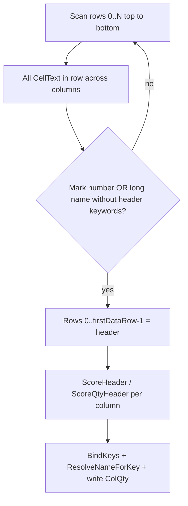

# Унификация: шапка и данные только по строкам сетки

## Проблема

В [`TableGrid.cs`](PosCounter.Net/SpecGrid/TableGrid.cs) (строки 626–634) добавлено деление по высоте:

```csharp
if (tableHeight < HeaderTopBandHeight)
    yLo = maxY - tableHeight * 0.35;  // «малая таблица»
else
    yLo = maxY - HeaderTopBandHeight; // «большая таблица»
```

Это **запрещено**: key/value, марка, наименование и «Кол.» должны работать **одинаково** для любой таблицы.

Key/value уже grid-based (`RowDataStart`, `IsBindableDataText`, `ResolveNameForKey`) — проблема только в **распознавании шапки**, где Y-полоса с ветвлением по размеру подмешивает data-тексты (Ушко) или требует костыль 35%.

## Решение (по вашему правилу)



### 1. Новый метод: граница шапки по строкам сетки

**Файл:** [`TableGrid.cs`](PosCounter.Net/SpecGrid/TableGrid.cs)

Добавить `FindFirstDataRowByGridScan(ScopeGridResult result)`:

- Идти `r = 0 .. rows-1`, для каждой строки — все ячейки `CellText[r, c]`.
- Строка = **данные**, если в ней есть хотя бы один текст:
  - **марка:** `TryParseMarkKey(cell)` и **не** `IsHeaderLabelInMarkCell(cell)` (отсечёт «Поз.», «№»);
  - **наименование-данные:** длина ≥ 8, есть буквы, `ScoreHeader(...)` по ключевым словам шапки == 0, не пустой qty в соседней ячейке (чтобы не путать с заголовком раздела без марки — reuse логики [`IsSectionHeaderRow`](PosCounter.Net/SpecGrid/TableGrid.cs)).
- `HeaderEndRow = RowDataStart = firstDataRow` (если найдена; иначе fallback на существующий `EstimateHeaderEndRow` по H-линиям).

Вызывать **до** `DetectHeader`, сразу после pass-1 `BuildCellMatrix` (когда `CellText` уже есть).

### 2. Новый primary path: `DetectHeaderByGridRows`

Заменить порядок в [`DetectHeader`](PosCounter.Net/SpecGrid/TableGrid.cs):

| Было | Станет |
|------|--------|
| 1. `DetectHeaderByTopTextBand` (Y-полоса + size split) | 1. **`DetectHeaderByGridRows`** — scoring только по строкам `0 .. HeaderEndRow-1` |
| 2. `DetectHeaderByColumns` fallback | 2. `DetectHeaderByColumns` fallback (уже grid-based) |
| — | 3. `DetectHeaderByTopTextBand` — **только last-resort**, без size split |

`DetectHeaderByGridRows`:
- Для каждого столбца `c`: собрать текст из `CellText[r,c]` для `r < HeaderEndRow` (аналог [`BuildHeaderOnlyColumnText`](PosCounter.Net/SpecGrid/TableGrid.cs)).
- Scoring: `ScoreHeader` (марка/наименование), [`ScoreQtyHeader`](PosCounter.Net/SpecGrid/TableGrid.cs) (без «ед», штраф «масса»).
- `EnsureUniqueHeaderColumns` → `SanitizeColQtyColumn` → `RefineColMarkByDataMarks`.

**Сохранить** из предыдущего плана (не size-dependent): `ScoreQtyHeader`, `SanitizeColQtyColumn`, name dedupe, CMD diagnostics.

### 3. Удалить деление малая/большая

- Удалить константу `SmallTableHeaderBandFraction` и ветку `tableHeight < HeaderTopBandHeight`.
- В `TryGetHeaderTopTextBandY` (если остаётся для CMD/fallback): всегда `yLo = maxY - HeaderTopBandHeight` — **одинаково для всех**.
- В `DetectHeaderByTopTextBand` (fallback): добавить фильтр `t.Row >= 0 && t.Row >= HeaderEndRow → skip` + skip `TryParseMarkKey` (уже есть).

### 4. Key / value / qty — без веток по размеру

**Не менять** (уже универсально):

- `BindKeysFromProperties` / `IsBindableDataText` — `Row >= RowDataStart`
- `ResolveNameForKey` — cell-only dedupe, neighbor fallback
- `SpecGridService` — запись «Кол.» по сетке ColQty

После grid scan `RowDataStart` будет согласован для Ушко, _tex_fek, 35NK одинаково.

### 5. Документация

- [`docs/DEVELOPER.md`](docs/DEVELOPER.md) §9 — описать `FindFirstDataRowByGridScan`, `DetectHeaderByGridRows`; убрать «малые таблицы 35%».
- [`Работа программы.md`](Работа программы.md) §«Распознавание шапки» — «идём по строкам сетки сверху вниз», без деления по высоте.
- [`.cursor/DIALOGUE_LOG.md`](.cursor/DIALOGUE_LOG.md) — запись об откате size split.
- [`.cursor/plans/fix_header_colqty_bleed_implementation.md`](.cursor/plans/fix_header_colqty_bleed_implementation.md) — обновить (не трогать исходный `.plan.md`).

## Файлы

| Файл | Изменения |
|------|-----------|
| [`TableGrid.cs`](PosCounter.Net/SpecGrid/TableGrid.cs) | grid scan, DetectHeaderByGridRows, убрать SmallTable split |
| [`SpecGridService.cs`](PosCounter.Net/SpecGrid/SpecGridService.cs) | CMD: лог `HeaderEndRow` / `firstDataRow` (опционально) |
| docs + DIALOGUE_LOG | унификация |

**Не трогать:** `PosCounterEngine`, dedupe имён, `ScoreQtyHeader`.

## Проверка

| Чертёж | Ожидание |
|--------|----------|
| **Ушко** | ColQty = «Кол.» (не «Масса»); марки 1–4 с именами |
| **_tex_fek mark 64** | одно имя без дубля; 2 строки палитры OK |
| **35NK** | шапка DBText/MText без регрессии |

Сборка: `build\build-ac2026.cmd` → NETLOAD свежей DLL.

Напишите **«готов»** — выполнить по этому плану.
