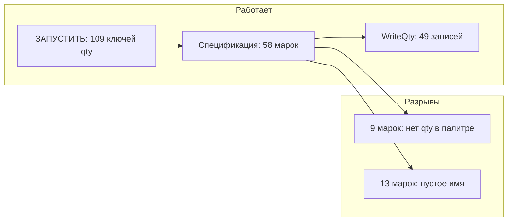

# Диагноз лога спецификации (build 2026-06-13 11:41)

## Краткий ответ

**Критической поломки нет.** Запись «Кол.» работает (`WriteQty итог: записано=49`). Сообщение в конце — **не сбой записи**, а отчёт: для 9 марок в спецификации **нет количества в палитре** после «ЗАПУСТИТЬ». Вторая проблема — **13 пустых наименований** в хвосте таблиц (алгоритм + тексты вне сетки).

Ошибка `сбой при выполнении LOAD: "pos_counter_2016_2026"` — **старый LISP** в `acad.lsp`, на NETLOAD не влияет ([`docs/INSTRUCTION_ENGINEER.md`](docs/INSTRUCTION_ENGINEER.md) §1).

---

## Что отработало корректно

| Показатель | Табл. 1 | Табл. 2 |
|------------|---------|---------|
| Объектов в рамке | 279 | 319 |
| KeyToRowMark | 26 | 32 |
| ColMark/ColName/ColQty | 0 / 2 / 3 | 0 / 2 / 3 |
| Источник ColQty | `layout` (fix →3) | `layout` (fix →3) |
| Имена заполнено | 19 / 26 | 26 / 32 |
| WriteQty (палитра) | да (часть 49) | да (часть 49) |

- Сетка mixed layers дополнена: `0_ГТ-20_Изм.1 + ГС_ВК`.
- Табл. 1 — лист **«продолжение»**: `HeaderEndRow=1`, шапка пустая, столбцы взяты по данным (`ColumnsInferredFromData`) — это ожидаемо для второго листа спецификации.
- `[SCHEMA] locked` в логе **нет**, потому что pass1 шапки дал `-1/-1/-1`; схема не залочилась, но **layout 0/2/3** всё равно применился через `TryInferColumnsFromData` + `ApplyStandardColumnLayout`.



---

## Проблема 1: «Количество не найдено в палитре» (9 марок)

**Марки:** `35, 43, 46, 49, 59, 97, 99, 102, 111`

**Механизм** ([`SpecGridService.cs`](PosCounter.Net/SpecGrid/SpecGridService.cs) `CollectMissingQtyMarksForScope`):

```csharp
foreach (var key in scope.KeyToRowMark.Keys)
    if (!qtyByKey.ContainsKey(key))
        missing.Add(key);
```

Перед спецификацией в логе: `Палитра qty: ключей=109`. В двух таблицах найдено **58** марок. Записано **49** — ровно те, у кого qty есть в `_lastCountRows`. **9 ключей в спецификации есть, в палитре после подсчёта — нет.**

Это **не баг WriteQty** (`пропущено=0` — ни одна запись не упала из‑за геометрии).

**Что проверить на чертеже (без правки кода):**
1. Есть ли выноски/блоки с марками 35, 43, 46, 49, 59, 97, 99, 102, 111 в зоне подсчёта?
2. Не отфильтрованы ли они слоем/типом при «ЗАПУСТИТЬ»?
3. Повторить **ЗАПУСТИТЬ** → **Выбрать спецификацию** после добавления объектов.

Пересечение с пустыми именами: только **46** и **99** — и нет qty, и нет имени.

---

## Проблема 2: Пустые наименования (13 марок)

**Табл. 1:** ключи `46, 52, 53, 54, 55, 56, 57` (7 пустых из 26)  
**Табл. 2:** ключи `99, 105, 106, 107, 108, 109` (6 пустых из 32)  
**Итого в палитру:** 45 имён из 58 марок.

### Группа A — текст найден, но отброшен (key=52)

```
[NAME] key=52 cellOnly=False rowTop=42 rowEndEx=46 ... parts=0 texts=1 «empty»
```

В [`ResolveNameForKey`](PosCounter.Net/SpecGrid/TableGrid.cs) один текст прошёл overlap/owner, `textCount=1`, но `AddNamePartsFromTextSample` не добавил строки — отсечение через `LooksLikeDesignationText` (ГОСТ/TB), `IsAcceptableNameContinuation` или `LooksLikeSectionHeaderLine`. При `ColDesignation=1` (layout 0/1/2/3) фильтр обозначений активен.

### Группа B — нет текста в полосе col2 (keys 53–57, 105–109)

```
[NAME] key=53..57 texts=0 «empty»
[NAME] key=105..109 texts=0 «empty»
```

Марки в **хвосте продолжений** с разреженным `KeyToRowMark` (пропуски строк: 55→row51, 56→row52, 57→row53, 58→row56). Диапазон `rowTop..rowEndEx` узкий (`nameLeadCap=nextKeyTop`), в col2 в этих строках **нет привязанного текста** — типично, если наименование только на предыдущем листе, а здесь остались номера позиций.

### Группа C — MText вне сетки (табл. 2)

```
Таблица 2 вне сетки: 5/188
#186 MText «ГОСТ 8958-75» Header=(137088,15112) Data=(134717,15112)
#187 MText «Ниппель Ц-50»   Header=(143309,15112) Data=(139717,15112)
```

Тексты с `Row=-1` / `Col=-1` после `AssignCellsData` — **сдвиг DataX ~2–3 тыс. мм** относительно Header (Location+Extents). Сбор имён идёт по ячейкам сетки и `AllTexts` с `IsTextInNameColumn` + `NameTextBelongsToMarkKey` — **вне-сеточные MText не попадают** в `MarkNamePairs`.

---

## Проблема 3 (косметика): LOAD LISP

`сбой при выполнении LOAD: "pos_counter_2016_2026"` — удалить из `acad.lsp` строку `(load "pos_counter_2016_2026")`. Использовать только **NETLOAD** `PosCounter.Net.dll`.

---

## План исправлений (если напишете «готов»)

Минимальный scope — только пустые имена и вне-сеточные MText; missing qty **не чинится кодом** (нужен подсчёт на чертеже).

### Шаг 1. Fallback для текстов вне сетки (табл. 2)

**Файл:** [`TableGrid.cs`](PosCounter.Net/SpecGrid/TableGrid.cs)

- После `AssignCellsData`, для `AllTexts` с `Row<0 || Col<0`: если `DataX` попадает в X-полосу `ColName`, присвоить `Col=ColName` и `Row` по `DataY` / overlap с `GridYs`.
- Диагностика: `[POSC-DIAG] unassigned→name col=2 row=… «Ниппель Ц-50»`.

Ожидаемый эффект: имена для марок рядом с #186–#187 (в т.ч. **99**, если текст был вне сетки).

### Шаг 2. Диагностика отброшенных строк имени

**Файл:** [`TableGrid.cs`](PosCounter.Net/SpecGrid/TableGrid.cs) — `AddNamePartsFromTextSample`

- Для trace-ключей 52–57, 105–109 логировать причину skip: `designation` / `section` / `not-acceptable` + текст.

Позволит подтвердить гипотезу для key=52 без догадок.

### Шаг 3. Хвост продолжения — расширить сбор при пустом col2

**Файл:** [`TableGrid.cs`](PosCounter.Net/SpecGrid/TableGrid.cs) — `ResolveNameForKey` / `SupplementNamePartsInVerticalBand`

- Если `parts.Count==0` и `ColumnsInferredFromData` (продолжение): для марки с merged-блоком (`markBlockEnd > rowTop+1`) расширить supplement по **вертикальной полосе col2** до `markBlockEnd`, не только до `nameLeadCap`, если в lead-row следующей марки нет standalone-имени.
- Осторожно: не возвращать bleed RU/EN (уже лечился `CapRowEndBeforeNextMarkNameLead` в [`fix_bilingual_names_gt20_header`](.cursor/plans/fix_bilingual_names_gt20_header.plan.md)).

### Шаг 4. Документация

- [`docs/DEVELOPER.md`](docs/DEVELOPER.md) — раздел «missing qty vs empty name».
- [`.cursor/DIALOGUE_LOG.md`](.cursor/DIALOGUE_LOG.md) — запись по результату теста.

### Критерии успеха после правок

| Проверка | Было | Цель |
|----------|------|------|
| Имена в палитру | 45 | ≥ 52 (хвост 52–57, 105–109 частично или полностью) |
| Вне сетки табл. 2 | 5/188 | ≤ 2/188 |
| WriteQty | 49 | 49 (без регрессии) |
| Missing qty | 9 марок | без изменений, пока нет подсчёта на чертеже |

---

## Что делать сейчас (без кода)

1. Убрать LISP из `acad.lsp`.
2. В палитре найти марки **35, 43, 46, 49, 59, 97, 99, 102, 111** — если строк нет, сделать **ЗАПУСТИТЬ** по зоне с выносками.
3. Для пустых имён 52–57 / 105–109: проверить на чертеже, есть ли **наименование на этом листе** или только номер позиции (продолжение с предыдущего листа).
4. Если нужны правки алгоритма — напишите **«готов»**, выполню план шагов 1–4.
