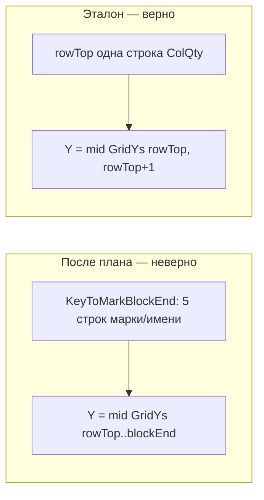

# Сравнение логики «Кол.» и откат регрессии

## Что не сломалось (цепочка та же)

Этапы до `WriteQtyScope` **не менялись** планом `центр_ячейки_кол` — совпадают с эталоном:

| Звено | Файл | Условие |
|-------|------|---------|
| Число из палитры | [`PaletteHost.cs`](PosCounter.Net/PaletteHost.cs) → [`PosCounterControl.xaml.cs`](PosCounter.Net/UI/PosCounterControl.xaml.cs) | `qtyByKey` из видимых строк или snapshot |
| Пустой qty | [`SpecGridService.cs:362`](PosCounter.Net/SpecGrid/SpecGridService.cs) | `qtyByKey.Count == 0` → запись 0 |
| Сетка | [`TableGrid.cs`](PosCounter.Net/SpecGrid/TableGrid.cs) | `Valid = xs>=4 && ys>=4` |
| Столбец «Кол.» | `DetectHeader` / `EnsureUniqueHeaderColumns` | `ColQty >= 0` |
| Марки → строки | `BindKeys` + `FindRowTopSub` | `KeyToRowTopSub[key] = rowTop` |
| Цикл записи | `WriteQtyScope` | по `KeyToRowTopSub.Keys`, марка в `qtyByKey` |

**Отличие от текста эталона (не из-за нашего плана):** высота текста сейчас `ResolveQtyTextHeight(appearance)` (из таблицы, fallback 2.5), а не константа 250.0 — это более ранняя доработка `spec-grid-qty-fix`.

---

## Где план сломал логику — единственное критичное изменение

### Эталон (правильная вставка в ColQty)

```csharp
// WriteQtyScope — одна строка сетки rowTop
var x = (scope.GridXs[col] + scope.GridXs[col + 1]) * 0.5;
var y = (scope.GridYs[rowTop] + scope.GridYs[rowTop + 1]) * 0.5;
var point = new Point3d(x, y, 0);
UpsertQtyText(tr, btr, scope, rowTop, col, point, ...);

// FindQtyTextInCell — только ячейка [rowTop, col]
if (!IsPointInCell(GetEntityTextPoint(ent), scope, row, col)) continue;
// tie-break: max длина текста (bestScore = plain.Trim().Length)
```

**Смысл:** «Кол.» пишется в **одну строку сетки** `rowTop` (после `FindRowTopSub`), центр — середина между `GridYs[rowTop]` и `GridYs[rowTop+1]`.

### Сейчас (после плана — регрессия)

```418:423:PosCounter.Net/SpecGrid/SpecGridService.cs
var rowBottomEx = ResolveQtyCellRowBottomEx(scope, rowTop, key);
var point = ResolveQtyInsertPoint(scope, rowTop, rowBottomEx, col);
UpsertQtyText(tr, btr, scope, rowTop, rowBottomEx, col, point, ...);
```

```1047:1083:PosCounter.Net/SpecGrid/SpecGridService.cs
// rowBottomEx берётся из KeyToMarkBlockEnd[key]
// Y = (GridYs[rowTop] + GridYs[rowBottomEx]) / 2  — центр БЛОКА МАРКИ/ИМЕНИ
```

```1174:1228:PosCounter.Net/SpecGrid/SpecGridService.cs
// FindQtyTextInCell ищет по span rowTop..rowBottomEx
// tie-break: ближайший к point.Y (смещённому Y)
```

### Почему это неверно для «Кол.»

`KeyToMarkBlockEnd` строится в [`GetMarkBlockEndExclusive`](PosCounter.Net/SpecGrid/TableGrid.cs) **по столбцу «Поз./Марка»** — до следующей марки, с расширением по Y текстов марки. Комментарий в коде: *«Линии сетки в Наименовании не режут блок»*.

Это span для **сборки имени**, не для ячейки «Кол.»:

- «Наименование» часто объединено на 3–5 строк;
- «Кол.» обычно **одна строка сетки на позицию** (между горизонталями в полосе ColQty);
- подстановка `blockEnd` из марки смещает Y в середину **слишком высокого** вертикального блока → цифра уезжает из своей ячейки ColQty.



**Комментарий инженера** (magenta, другой слой) на Y **не влияет** ни в эталоне, ни сейчас — он фильтруется `IsExcludedAnnotationLayer` / `PassesTableBodyLayerForQtyStyle`. Проблема на скриншоте была не в комментарии, а в ошибочной привязке Y к блоку имени.

---

## Полная цепочка «от чего зависит запись в Кол.» (актуальный код)

### 1. Откуда число

[`Commands.cs`](PosCounter.Net/Commands.cs) → `PaletteHost.TryBuildQtyByKeyForWriteback` → `TryBuildQtyByKeyFromVisibleRows` / snapshot.

### 2. Уровень таблицы

- `scope.Valid`, `scope.ColQty >= 0`
- `KeyToRowTopSub` не пуст (марки в «Поз.»)

### 3. Уровень марки (главный цикл)

[`WriteQtyScope`](PosCounter.Net/SpecGrid/SpecGridService.cs) — **здесь сейчас расхождение с эталоном** (см. выше).

### 4. Координаты (эталон)

- **X:** `(GridXs[col] + GridXs[col+1]) / 2` — [`ResolveVisualQtyColumnCenterX`](PosCounter.Net/SpecGrid/SpecGridService.cs)
- **Y (эталон):** `(GridYs[rowTop] + GridYs[rowTop+1]) / 2` — **одна строка**
- **Y (сломано):** span до `KeyToMarkBlockEnd` — **откатить**

### 5. Upsert в ячейке

[`UpsertQtyText`](PosCounter.Net/SpecGrid/SpecGridService.cs): `FindQtyTextInCell` → update DBText/MText или новый DBText; `ApplyQtyCenterAlignment` / `MiddleCenter`.

---

## План исправления (откат + безопасность)

### Шаг 1 — Откат span-логики в [`SpecGridService.cs`](PosCounter.Net/SpecGrid/SpecGridService.cs)

Удалить:
- `ResolveQtyCellRowBottomEx`
- `IsPointInQtyCellSpan`

Вернуть эталон в `WriteQtyScope`:

```csharp
var x = (scope.GridXs[col] + scope.GridXs[col + 1]) * 0.5;
var y = (scope.GridYs[rowTop] + scope.GridYs[rowTop + 1]) * 0.5;
var point = new Point3d(x, y, 0);
UpsertQtyText(tr, btr, scope, rowTop, col, point, text, appearance, log, scope.ScopeIndex, key);
```

Вернуть `FindQtyTextInCell(tr, scope, row, col)` с `IsPointInCell` и tie-break по длине текста (как эталон).

Вернуть сигнатуру `UpsertQtyText(..., int row, int col, ...)` без `rowBottomEx`.

Опционально оставить `ResolveQtyInsertPoint(scope, rowTop, col)` как thin wrapper для X+Y — или inline как в эталоне.

### Шаг 2 — Документация

- [`docs/DEVELOPER.md`](docs/DEVELOPER.md) — Y снова по **одной строке** `rowTop`; явно: `KeyToMarkBlockEnd` **не** используется для ColQty.
- [`.cursor/DIALOGUE_LOG.md`](.cursor/DIALOGUE_LOG.md) — запись об откате и причине.

### Шаг 3 — Сборка и проверка

- `build\build-ac2026.cmd`
- NETLOAD → ЗАПУСТИТЬ → Выбрать спецификацию
- «Кол.» в правильных ячейках, как до плана
- Ячейка с magenta-комментарием: qty по центру **своей строки** ColQty; комментарий не тронут

### (Отложено) Если после отката qty всё ещё смещён вверх на скриншоте

Отдельная задача — span **только по горизонталям в полосе X столбца ColQty** (`HasHBorderAt` при `xL..xR` ColQty), **не** `KeyToMarkBlockEnd`. Применять только если в ColQty нет внутренней H-линии на `rowTop+1`.

---

## Затрагиваемые файлы

| Файл | Действие |
|------|----------|
| [`SpecGridService.cs`](PosCounter.Net/SpecGrid/SpecGridService.cs) | Откат span; восстановление эталонного Y и FindQtyTextInCell |
| [`docs/DEVELOPER.md`](docs/DEVELOPER.md) | Исправить описание Y |
| [`.cursor/DIALOGUE_LOG.md`](.cursor/DIALOGUE_LOG.md) | Запись об откате |

**Не трогаем:** `TableGrid.cs`, `BindKeys`, палитру, `KeyToMarkBlockEnd`.
