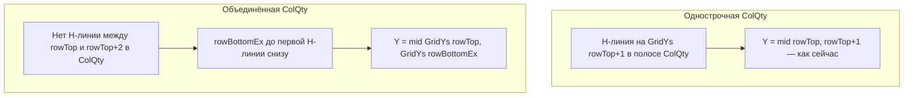

# Центр «Кол.» при пометках инженера (span по сетке ColQty)

## Диагноз

**Откат сработал:** вставка в правильную колонку и строку восстановлена.

**Остаётся симптом:** в ячейках с пометками инженера (magenta, другой слой) цифра **выше** геометрического центра ячейки.

**Причина (не комментарий):** пометки **не участвуют** в расчёте Y — они отфильтровываются `IsExcludedAnnotationLayer` / `PassesTableBodyLayerForQtyStyle`. Проблема в геометрии:

- `rowTop` из `KeyToRowTopSub` — верх **объединённого блока** позиции;
- «Наименование» часто занимает 2–5 строк **без** горизонтали через всю ширину в ColMark;
- «Кол.» при этом часто **объединена на ту же высоту**, но внутренние горизонтали в полосе X ColQty **отсутствуют**;
- текущий код: `Y = (GridYs[rowTop] + GridYs[rowTop+1]) / 2` — центр **только верхней подстроки** сетки;
- пометка внизу ячейки визуально подчёркивает, что цифра «прилипла» к верху объединённой ячейки.

**Почему нельзя `KeyToMarkBlockEnd`:** span строится по ColMark/имени («линии в Наименовании не режут блок») — это дало регрессию при прошлом плане [`центр_ячейки_кол`](.cursor/plans/центр_ячейки_кол_e7567a19.plan.md) (цифра уезжала из своей ячейки ColQty).

**Правильный источник span:** горизонтали сетки **в полосе X столбца ColQty** — уже есть в `scope.HorizontalLines` и [`TableGridBuilder.HasHBorderAt`](PosCounter.Net/SpecGrid/TableGrid.cs).

---

## Чем этот план отличается от сломанного `центр_ячейки_кол`

| | Сломанный план (регрессия) | Этот план (безопасный) |
|--|---------------------------|------------------------|
| Источник нижней границы | `KeyToMarkBlockEnd[key]` из `GetMarkBlockEndExclusive` (ColMark / имя) | `HasHBorderAt` в полосе **X ColQty** + `scope.HorizontalLines` |
| Полоса X для span | ColMark (косвенно через блок марки) | `GridXs[colQty] .. GridXs[colQty+1]` |
| Однострочная ColQty | могла получить span 3–5 строк имени | H-линия на `rowTop+1` в ColQty → `rowBottomEx = rowTop+1` → **идентично откату** |
| `rowTop` / `ColQty` / `qtyByKey` | не менялись, но Y уехал | **не меняются**; меняется только Y при `rowBottomEx > rowTop+1` |
| `FindQtyTextInCell` | всегда span + tie-break по Y | span **только** при `rowBottomEx > rowTop+1`; иначе **точная копия** текущего кода |
| Файлы | `SpecGridService.cs` | **только** `SpecGridService.cs`; `TableGrid.BindKeys` **не трогаем** |

### Жёсткие запреты (checklist перед merge)

- **ЗАПРЕЩЕНО:** `KeyToMarkBlockEnd`, `GetMarkBlockEndExclusive`, ColMark X-band для расчёта Y ColQty.
- **ЗАПРЕЩЕНО:** менять `BindKeys`, `FindRowTopSub`, цикл `KeyToRowTopSub`, `PaletteHost`, `TableGrid.cs`.
- **ЗАПРЕЩЕНО:** ослаблять `IsExcludedAnnotationLayer` / `PassesTableBodyLayerForQtyStyle` / `IsLikelyQtyCellText`.
- **ЗАПРЕЩЕНО:** применять `IsPointInQtyCellSpan` и tie-break по Y, если `rowBottomEx == rowTop + 1`.

### Инварианты (не меняются при реализации)

1. `col = scope.ColQty` — тот же столбец, что распознан в шапке.
2. `rowTop = KeyToRowTopSub[key]` — та же строка записи, что после отката.
3. **X** — только `ResolveVisualQtyColumnCenterX` (центр ColQty по `GridXs`).
4. **Y при однострочной ячейке:** `(GridYs[rowTop] + GridYs[rowTop+1]) / 2` — как сейчас после отката.
5. Цепочка qty: `TryBuildQtyByKeyForWriteback` → `WriteQtyScope` → `UpsertQtyText` — без изменений условий входа.



---

## Решение (только [`SpecGridService.cs`](PosCounter.Net/SpecGrid/SpecGridService.cs))

### 1. `ResolveQtyCellRowBottomExByColQtyGrid`

Новый helper — нижняя граница ячейки «Кол.» (exclusive row index):

```csharp
private static int ResolveQtyCellRowBottomExByColQtyGrid(ScopeGridResult scope, int rowTop, int colQty, int key)
{
    var fallback = rowTop + 1;
    if (scope?.GridYs == null || scope.GridYs.Count < 2) return fallback;
    if (rowTop < 0 || rowTop >= scope.GridYs.Count - 1) return fallback;
    if (colQty < 0 || colQty >= scope.GridXs.Count - 1) return fallback;

    var horiz = scope.HorizontalLines;
    if (horiz == null || horiz.Count == 0) return fallback;

    var xL = scope.GridXs[colQty];
    var xR = scope.GridXs[colQty + 1];
    var rowBottomEx = rowTop + 1;
    while (rowBottomEx < scope.GridYs.Count - 1)
    {
        if (TableGridBuilder.HasHBorderAt(
                scope.GridYs[rowBottomEx], xL, xR, horiz, borderEps: TableGridBuilder.EpsAxis * 3.0))
            break;
        rowBottomEx++;
    }
    // Потолок: не залезать на следующую позицию (верх следующей марки), НЕ KeyToMarkBlockEnd
    rowBottomEx = Math.Min(rowBottomEx, ResolveNextKeyRowTopEx(scope, key));
    rowBottomEx = Math.Min(rowBottomEx, scope.GridYs.Count - 1);
    return rowBottomEx <= rowTop ? fallback : rowBottomEx;
}

// Верх rowTop следующей марки в KeyToRowTopSub, иначе GridYs.Count-1
private static int ResolveNextKeyRowTopEx(ScopeGridResult scope, int key)
{
    foreach (var kv in scope.KeyToRowTopSub.OrderBy(x => x.Key))
    {
        if (kv.Key > key) return kv.Value;
    }
    return scope.GridYs.Count - 1;
}
```

- `TableGridBuilder.EpsAxis` — public const (1.5), доступен из `SpecGridService`.
- **Однострочная ячейка:** на `GridYs[rowTop+1]` есть H-линия в ColQty → `rowBottomEx = rowTop+1` → **поведение идентично откату**.
- **Объединённая ColQty:** нет внутренней H-линии → `rowBottomEx` растёт до нижней границы **в полосе ColQty**, но не ниже следующей марки.
- **Fallback:** нет `HorizontalLines` / некорректный span → `rowTop+1` (как сейчас).

### 2. `ResolveQtyInsertPoint` — принять `rowBottomEx`

```csharp
private static Point3d ResolveQtyInsertPoint(ScopeGridResult scope, int rowTop, int rowBottomEx, int colQty)
{
    var y = (scope.GridYs[rowTop] + scope.GridYs[rowBottomEx]) * 0.5;
    var x = ResolveVisualQtyColumnCenterX(scope, colQty);
    return new Point3d(x, y, 0);
}
```

### 3. `WriteQtyScope`

```csharp
var rowBottomEx = ResolveQtyCellRowBottomExByColQtyGrid(scope, rowTop, col, key);
var point = ResolveQtyInsertPoint(scope, rowTop, rowBottomEx, col);
UpsertQtyText(tr, btr, scope, rowTop, rowBottomEx, col, point, ...);
```

**Важно:** `rowTop` и `col` не пересчитываются — только `rowBottomEx` для Y.

### 4. `FindQtyTextInCell` + `IsPointInQtyCellSpan`

- **`rowBottomEx == rowTop + 1` (однострочная):** `IsPointInCell` + tie-break **по длине текста** — **как сейчас после отката**, без изменений.
- **`rowBottomEx > rowTop + 1` (объединённая ColQty):** `IsPointInQtyCellSpan` + tie-break **ближайший к `point.Y`**.
- Фильтры слоя / `IsLikelyQtyCellText` — **без изменений** (пометки не трогаем).

### 5. `UpsertQtyText`

- Передавать `rowBottomEx` и `point.Y` в `FindQtyTextInCell`.
- `ApplyQtyCenterAlignment` / `ApplyQtyCenterAlignmentForMText` — **уже вызываются**; после смены Y существующий DBText должен переехать в центр.

**Не менять:** `TableGrid.BindKeys`, `KeyToMarkBlockEnd`, `GetMarkBlockEndExclusive`, палитру.

---

## Защита от регрессии (в т.ч. повтор `центр_ячейки_кol`)

| Риск | Митигация |
|------|-----------|
| Повтор ошибки `KeyToMarkBlockEnd` | **Запрещено** в коде; span только `HasHBorderAt` + ColQty X-band |
| Нет `HorizontalLines` | fallback `rowTop+1` → поведение = откат |
| Однострочная ColQty | H-линия на `rowTop+1` → span = 1 строка; FindQtyTextInCell **без изменений** |
| Span «улетает» до конца таблицы | cap `ResolveNextKeyRowTopEx` (верх **следующей** марки, не `KeyToMarkBlockEnd`) |
| Пометка «41» на другом слое | фильтры без изменений |
| Две цифры в merged span | tie-break по Y + фильтры слоя |
| Исключение при upsert | `try/catch` → `skipped++` |
| Регрессия обычных строк | gate: новая логика **только** при `rowBottomEx > rowTop+1` |

### Контрольная проверка после реализации

1. Таблица **без** merged ColQty: координаты qty **побитово** как после отката (diff только если `rowBottomEx > rowTop+1` — не должно быть).
2. Таблица **с** merged ColQty + пометка: Y опустился в центр ячейки; пометка на месте; ColQty не уехала в соседнюю строку.
3. Grep по `SpecGridService.cs`: **0** вхождений `KeyToMarkBlockEnd`, `GetMarkBlockEndExclusive`.

---

## Документация

- [`docs/DEVELOPER.md`](docs/DEVELOPER.md) — Y по span ColQty через `HorizontalLines` + `HasHBorderAt`; явно: не `KeyToMarkBlockEnd`.
- [`.cursor/DIALOGUE_LOG.md`](.cursor/DIALOGUE_LOG.md) — запись о правке.

---

## Проверка

1. `build\build-ac2026.cmd`
2. NETLOAD → ЗАПУСТИТЬ → Выбрать спецификацию
3. Ячейка **без** пометки / однострочная ColQty — как после отката (без регрессии)
4. Ячейка **с magenta-пометкой** в объединённой ColQty — qty по **вертикальному центру** ячейки; пометка на месте
5. Обычные строки без merge — qty в той же позиции, что до этой правки
