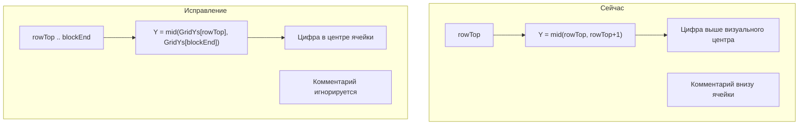

# Центрирование «Кол.» в ячейке независимо от комментариев

## Симптом (скриншот)

В ячейке колонки «Кол.»:
- белая цифра количества (**39**) смещена **вверх**;
- ниже — **комментарий инженера** (magenta, другой слой, «41» с зачёркиванием).

Требование: количество всегда в **геометрическом центре ячейки**, независимо от наличия/положения комментария.

## Диагностика по коду

Точка вставки сейчас в [`SpecGridService.cs`](PosCounter.Net/SpecGrid/SpecGridService.cs):

```1044:1048:PosCounter.Net/SpecGrid/SpecGridService.cs
private static Point3d ResolveQtyInsertPoint(ScopeGridResult scope, int rowTop, int colQty)
{
    var y = (scope.GridYs[rowTop] + scope.GridYs[rowTop + 1]) * 0.5;
    var x = ResolveVisualQtyColumnCenterX(scope, colQty);
    return new Point3d(x, y, 0);
}
```

**X** уже корректен — центр между `GridXs[colQty]` и `GridXs[colQty+1]` (не зависит от текста).

**Y — корень проблемы:** берётся середина **только одной строки сетки** `rowTop..rowTop+1`, хотя позиция марки часто занимает **объединённый блок** из нескольких строк.

При `BindKeys` уже вычисляется полный вертикальный span:

```1911:1917:PosCounter.Net/SpecGrid/TableGrid.cs
foreach (var kv in result.KeyToRowMark)
{
    var rowMark = kv.Value;
    var rowTop = FindRowTopSub(result, horiz, rowMark);
    result.KeyToRowTopSub[kv.Key] = rowTop;
    var blockEnd = GetMarkBlockEndExclusive(result, rowTop, kv.Key);
    result.KeyToMarkBlockEnd[kv.Key] = blockEnd;
```

Для объединённой ячейки (2–5 строк «Наименование») центр должен быть:

```text
Y = (GridYs[rowTop] + GridYs[blockEnd]) / 2
```

где `blockEnd` — **exclusive** индекс нижней границы блока (уже есть в `KeyToMarkBlockEnd`).

Комментарии инженера **не участвуют** в расчёте Y (слой в `ExcludedAnnotationLayers`, фильтруются в `FindQtyTextInCell`). Визуальное смещение — из-за центра **верхней подстроки**, а не из-за комментария.



## Решение

### 1. Расширить `ResolveQtyInsertPoint` — полный вертикальный span (с защитой)

Файл: [`SpecGridService.cs`](PosCounter.Net/SpecGrid/SpecGridService.cs)

Вынести расчёт span в отдельный **безопасный** helper (не трогать `GetMarkBlockEndExclusive` / `TableGrid.cs`):

```csharp
/// <summary>Нижняя граница ячейки «Кол.» (exclusive row index). При любой ошибке — rowTop+1 (старое поведение).</summary>
private static int ResolveQtyCellRowBottomEx(ScopeGridResult scope, int rowTop, int key)
{
    var fallback = rowTop + 1;
    if (scope?.GridYs == null || scope.GridYs.Count < 2)
        return fallback;
    if (rowTop < 0 || rowTop >= scope.GridYs.Count - 1)
        return fallback;

    if (!scope.KeyToMarkBlockEnd.TryGetValue(key, out var blockEnd))
        return fallback;
    if (blockEnd <= rowTop + 1)
        return fallback; // однострочная ячейка — без изменений

    blockEnd = Math.Min(blockEnd, scope.GridYs.Count - 1);
    if (blockEnd <= rowTop)
        return fallback;

    return blockEnd;
}
```

- **Y** = `(scope.GridYs[rowTop] + scope.GridYs[rowBottomEx]) * 0.5` только при `rowBottomEx > rowTop + 1`.
- Иначе — **та же формула, что сейчас**: `(GridYs[rowTop] + GridYs[rowTop+1]) / 2`.

В [`WriteQtyScope`](PosCounter.Net/SpecGrid/SpecGridService.cs):

```csharp
var rowBottomEx = ResolveQtyCellRowBottomEx(scope, rowTop, key);
var point = ResolveQtyInsertPoint(scope, rowTop, rowBottomEx, col);
```

**Не меняем:** `GetMarkBlockEndExclusive`, `BindKeys`, логику merge-блоков в [`TableGrid.cs`](PosCounter.Net/SpecGrid/TableGrid.cs).

### 2. Поиск существующего qty-текста — по span, без ослабления фильтров

[`FindQtyTextInCell`](PosCounter.Net/SpecGrid/SpecGridService.cs) — расширить зону поиска, **фильтры не ослаблять**:

- Новый helper `IsPointInQtyCellSpan(pt, scope, rowTop, rowBottomEx, col)` — только геометрия X/Y span.
- Сохранить все существующие отсечки:
  - `IsExcludedAnnotationLayer` — комментарий на magenta-слое **не трогаем**;
  - `PassesTableBodyLayerForQtyStyle(..., allowAnyTableContentLayer: false)` — только штатный слой таблицы;
  - `IsLikelyQtyCellText` — короткое число без букв/символов (зачёркнутый «41» на слое примечания не пройдёт).

**Защита от двух цифр в блоке:** если кандидатов несколько — выбирать текст **ближайший к целевому центру Y** (а не просто с max длиной). Это снижает риск обновить «чужую» цифру в соседней подстроке.

- Если кандидатов нет — создать новый DBText в центре (как сейчас).
- `UpsertQtyText` — передавать `rowBottomEx`; при ошибке `try/catch` в `WriteQtyScope` уже есть (`skipped++`), не менять.

**Не менять:** сигнатуру публичных API, `TableGrid`, `BindKeys`, `ExcludedAnnotationLayers`.

### 3. Принудительное выравнивание при upsert (проверка)

[`UpsertQtyText`](PosCounter.Net/SpecGrid/SpecGridService.cs) уже вызывает:
- DBText: `ApplyQtyCenterAlignment(db, point)` — `TextVerticalMid` + `TextCenter`;
- MText: `ApplyQtyCenterAlignmentForMText(mt, point)` — `MiddleCenter`.

После смены Y убедиться, что **и для update, и для create** `point` — новый центр span-ячейки. Дополнительных изменений не требуется, если Y исправлен.

### 4. Документация

- [`docs/DEVELOPER.md`](docs/DEVELOPER.md) — обновить строку про `ResolveQtyInsertPoint`: Y по **полному блоку строк** (`KeyToMarkBlockEnd`), не по одной строке; комментарии не влияют.
- [`.cursor/DIALOGUE_LOG.md`](.cursor/DIALOGUE_LOG.md) — запись после реализации.

## Затрагиваемые файлы

| Файл | Изменение |
|------|-----------|
| [`SpecGridService.cs`](PosCounter.Net/SpecGrid/SpecGridService.cs) | `ResolveQtyInsertPoint` + span; `WriteQtyScope`; `FindQtyTextInCell`; helper `IsPointInQtyCellSpan` |
| [`docs/DEVELOPER.md`](docs/DEVELOPER.md) | Описание центрирования Y |
| [`.cursor/DIALOGUE_LOG.md`](.cursor/DIALOGUE_LOG.md) | Запись о правке |

## Проверка

1. Сборка: `build\build-ac2026.cmd`
2. NETLOAD → ЗАПУСТИТЬ → Выбрать спецификацию на чертеже со скриншота (ячейка с magenta-комментарием)
3. Цифра «Кол.» — **по центру ячейки** по вертикали и горизонтали; комментарий **на месте**
4. Ячейка **без комментария** — центрирование не ухудшилось
5. **Однострочная** ячейка — поведение как раньше (span = 1 строка)
6. **Объединённая** ячейка (2+ строки наименования) — qty в центре всего блока, не верхней подстроки

## Риски и защита от поломки

| Риск | Митигация в плане |
|------|-------------------|
| `KeyToMarkBlockEnd[key] > GridYs.Count-1` | `Math.Min(blockEnd, GridYs.Count-1)` + проверка `blockEnd > rowTop`, иначе fallback `rowTop+1` |
| Пустые строки в блоке смещают центр вниз | **Не меняем** `GetMarkBlockEndExclusive` — это существующая логика merge; правка только в точке вставки Y |
| Две цифры в разных строках блока — обновится не та | Фильтры слоя + `IsLikelyQtyCellText` **сохраняются**; tie-break: ближайший к целевому Y центру |
| Комментарий «41» на другом слое/цвете | `IsExcludedAnnotationLayer` + `PassesTableBodyLayerForQtyStyle` — **не трогаем** |
| Неверно определённый блок (старый баг) | Не вносим новый баг: при `blockEnd <= rowTop+1` поведение **идентично текущему** |
| Исключение при upsert | Существующий `try/catch` в `WriteQtyScope` → `skipped++`, программа не падает |
| Регрессия однострочных ячеек | `ResolveQtyCellRowBottomEx` возвращает `rowTop+1` → формула Y **не меняется** |

**Принцип минимального diff:** меняется только [`SpecGridService.cs`](PosCounter.Net/SpecGrid/SpecGridService.cs) — расчёт Y и зона поиска qty. Без правок `TableGrid`, `BindKeys`, палитры, команд AutoCAD.

**Откат:** если span некорректен — helper всегда возвращает `rowTop+1` (текущее поведение).
